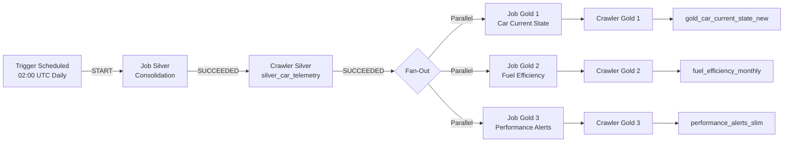

# 📋 INVENTÁRIO DE COMPONENTES - PIPELINE CAR LAKEHOUSE
**Data de Atualização**: 05 de Novembro de 2025  
**Versão**: 2.0 (Atualizado após remoção de referências a car_silver)  
**Ambiente**: Development (dev)

---

## 🗂️ 1. GLUE DATA CATALOG

### 1.1 Database
| Nome | Descrição | Catalog ID | Data de Criação |
|------|-----------|------------|-----------------|
| `datalake-pipeline-catalog-dev` | Database principal do Data Lakehouse | 901207488135 | 2025-10-29 15:15:43 |

### 1.2 Tabelas (4 tabelas ativas)

#### 📊 Tabela Bronze
| Propriedade | Valor |
|------------|-------|
| **Nome** | `car_bronze` |
| **Camada** | Bronze (Raw Data) |
| **Localização S3** | `s3://datalake-pipeline-bronze-dev/bronze/car_data/` |
| **Formato** | JSON (raw) |
| **Particionamento** | Não particionado |
| **Criada em** | 2025-11-05 15:30:56 |
| **Atualizada por** | Crawler: `datalake-pipeline-bronze-car-data-crawler-dev` |
| **Descrição** | Dados brutos copiados do Landing Zone (formato original) |

#### 📊 Tabela Silver
| Propriedade | Valor |
|------------|-------|
| **Nome** | `silver_car_telemetry` |
| **Camada** | Silver (Cleaned & Structured) |
| **Localização S3** | `s3://datalake-pipeline-silver-dev/car_telemetry/` |
| **Formato** | Parquet (compactado, snappy) |
| **Particionamento** | `event_year`, `event_month`, `event_day` |
| **Criada em** | 2025-11-05 16:03:46 |
| **Atualizada por** | Crawler: `datalake-pipeline-silver-crawler-dev` |
| **Schema** | 56 colunas (snake_case, flattened) |
| **Descrição** | Dados limpos, transformados e padronizados (deduplicated) |

#### 📊 Tabelas Gold

##### Gold 1: Car Current State
| Propriedade | Valor |
|------------|-------|
| **Nome** | `gold_car_current_state_new` |
| **Camada** | Gold (Business Aggregations) |
| **Localização S3** | `s3://datalake-pipeline-gold-dev/gold_car_current_state_new/` |
| **Formato** | Parquet (compactado, snappy) |
| **Particionamento** | Não particionado |
| **Criada em** | 2025-11-05 17:43:51 |
| **Atualizada por** | Crawler: `gold_car_current_state_crawler` |
| **Descrição** | Estado atual de cada veículo (última telemetria + info estática) |

##### Gold 2: Fuel Efficiency Monthly
| Propriedade | Valor |
|------------|-------|
| **Nome** | `fuel_efficiency_monthly` |
| **Camada** | Gold (Business Aggregations) |
| **Localização S3** | `s3://datalake-pipeline-gold-dev/fuel_efficiency_monthly/` |
| **Formato** | Parquet (compactado, snappy) |
| **Particionamento** | Não particionado |
| **Criada em** | 2025-11-05 18:07:35 |
| **Atualizada por** | Crawler: `datalake-pipeline-gold-fuel-efficiency-crawler-dev` |
| **Descrição** | Métricas de eficiência de combustível agregadas mensalmente |

---

## 🚀 2. AWS GLUE JOBS

**Total**: 5 jobs (1 Silver + 3 Gold ativos + 1 Gold legacy)

### 2.1 Job Silver (Consolidação e Limpeza)
| Propriedade | Valor |
|------------|-------|
| **Nome** | `datalake-pipeline-silver-consolidation-dev` |
| **Camada** | Bronze → Silver |
| **Script** | `s3://datalake-pipeline-glue-scripts-dev/glue_jobs/silver_consolidation_job.py` |
| **Glue Version** | 4.0 |
| **Worker Type** | G.1X |
| **Workers** | 2 |
| **Timeout** | 20 minutos |
| **Max Retries** | 0 |
| **Role IAM** | `arn:aws:iam::901207488135:role/datalake-pipeline-glue-job-role-dev` |
| **Job Bookmark** | Enabled |

**Parâmetros:**
```json
{
  "--job-bookmark-option": "job-bookmark-enable",
  "--bronze_database": "datalake-pipeline-catalog-dev",
  "--bronze_table": "car_bronze",
  "--silver_path": "car_telemetry",
  "--silver_bucket": "datalake-pipeline-silver-dev",
  "--enable-glue-datacatalog": "true",
  "--enable-continuous-cloudwatch-log": "true",
  "--enable-metrics": "true"
}
```

**Fluxo de Dados:**
```
┌──────────────────┐
│  car_bronze      │ (Glue Catalog)
│  (JSON raw)      │
└────────┬─────────┘
         │ READ
         ▼
┌──────────────────────────────────────┐
│  silver_consolidation_job.py         │
│  • Flatten nested JSON               │
│  • Convert to snake_case (56 cols)   │
│  • Deduplicate (Window + row_number) │
│  • Add processing_timestamp          │
│  • Validate schema                   │
└────────┬─────────────────────────────┘
         │ WRITE (Parquet)
         ▼
┌──────────────────┐
│  S3 Silver       │
│  car_telemetry/  │
│  event_year=YYYY │
│  event_month=MM  │
│  event_day=DD    │
└──────────────────┘
         │ CRAWLED BY
         ▼
┌──────────────────┐
│ silver_car_      │
│ telemetry (Table)│
└──────────────────┘
```

### 2.2 Jobs Gold (Agregações de Negócio)

#### Job Gold 1: Car Current State
| Propriedade | Valor |
|------------|-------|
| **Nome** | `datalake-pipeline-gold-car-current-state-dev` |
| **Camada** | Silver → Gold |
| **Script** | `s3://datalake-pipeline-glue-scripts-dev/glue_jobs/gold_car_current_state_job.py` |
| **Role IAM** | `arn:aws:iam::901207488135:role/datalake-pipeline-gold-job-role-dev` |
| **Glue Version** | 4.0 |
| **Workers** | 2 (G.1X) |

**Parâmetros:**
```json
{
  "--silver_database": "datalake-pipeline-catalog-dev",
  "--silver_table": "silver_car_telemetry",
  "--gold_path": "gold_car_current_state_new",
  "--gold_bucket": "datalake-pipeline-gold-dev"
}
```

**Transformações:**
- Seleciona última telemetria por veículo (`car_chassis`)
- Une com informações estáticas do veículo
- Calcula status de seguro (válido/expirado)
- Valida integridade dos dados
- Gera relatório de estado atual

**Fluxo de Dados:**
```
┌──────────────────────┐
│ silver_car_telemetry │ (Glue Catalog)
└──────────┬───────────┘
           │ READ (56 cols snake_case)
           ▼
┌──────────────────────────────────┐
│ gold_car_current_state_job.py    │
│ • Window: last_value over        │
│   partition by car_chassis       │
│ • Join static + telemetry        │
│ • Calculate insurance status     │
│ • Select 12 key columns          │
└──────────┬───────────────────────┘
           │ WRITE (Parquet)
           ▼
┌────────────────────────────┐
│ S3 Gold                    │
│ gold_car_current_state_new/│
└────────────────────────────┘
           │ CRAWLED BY
           ▼
┌────────────────────────────┐
│ gold_car_current_state_new │ (Table)
└────────────────────────────┘
```

#### Job Gold 2: Fuel Efficiency
| Propriedade | Valor |
|------------|-------|
| **Nome** | `datalake-pipeline-gold-fuel-efficiency-dev` |
| **Camada** | Silver → Gold |
| **Script** | `s3://datalake-pipeline-glue-scripts-dev/glue_jobs/gold_fuel_efficiency_job.py` |
| **Role IAM** | `arn:aws:iam::901207488135:role/datalake-pipeline-gold-job-role-dev` |
| **Glue Version** | 4.0 |
| **Workers** | 2 (G.1X) |

**Parâmetros:**
```json
{
  "--silver_database": "datalake-pipeline-catalog-dev",
  "--silver_table": "silver_car_telemetry",
  "--gold_path": "fuel_efficiency_monthly",
  "--gold_bucket": "datalake-pipeline-gold-dev"
}
```

**Transformações:**
- Agrega dados de viagem por veículo e mês
- Calcula eficiência de combustível (km/l)
- Métricas: distância total, combustível consumido, número de viagens
- Identifica padrões de consumo

**Fluxo de Dados:**
```
┌──────────────────────┐
│ silver_car_telemetry │
└──────────┬───────────┘
           │ READ (trip fields)
           ▼
┌──────────────────────────────────┐
│ gold_fuel_efficiency_job.py      │
│ • Extract year, month from date  │
│ • GroupBy: car_chassis, year, mo │
│ • SUM: trip_distance_km          │
│ • SUM: trip_fuel_consumed_liters │
│ • Calculate: avg_fuel_efficiency │
└──────────┬───────────────────────┘
           │ WRITE (Parquet)
           ▼
┌──────────────────────────┐
│ S3 Gold                  │
│ fuel_efficiency_monthly/ │
└──────────────────────────┘
           │ CRAWLED BY
           ▼
┌──────────────────────────┐
│ fuel_efficiency_monthly  │ (Table)
└──────────────────────────┘
```

#### Job Gold 3: Performance Alerts Slim
| Propriedade | Valor |
|------------|-------|
| **Nome** | `datalake-pipeline-gold-performance-alerts-slim-dev` |
| **Camada** | Silver → Gold |
| **Script** | `s3://datalake-pipeline-glue-scripts-dev/glue_jobs/gold_performance_alerts_slim_job.py` |
| **Role IAM** | `arn:aws:iam::901207488135:role/datalake-pipeline-gold-job-role-dev` |
| **Glue Version** | 4.0 |
| **Workers** | 2 (G.1X) |
| **Status** | ✅ **ATIVO** (parte do workflow) |

**Parâmetros:**
```json
{
  "--silver_database": "datalake-pipeline-catalog-dev",
  "--silver_table": "silver_car_telemetry",
  "--gold_path": "gold_performance_alerts_slim",
  "--gold_bucket": "datalake-pipeline-gold-dev"
}
```

**Transformações:**
- Identifica alertas de performance baseados em thresholds
- Monitora métricas críticas (temperatura motor, pressão pneus, bateria)
- Gera log de alertas para veículos com anomalias
- Versão "slim" (otimizada) do job original

**Execuções Recentes (2025-11-05):**
- 19:03 → SUCCEEDED (106s)
- 18:03 → SUCCEEDED (113s)
- 17:06 → SUCCEEDED (75s)
- 16:59 → SUCCEEDED (65s)

**Fluxo de Dados:**
```
┌──────────────────────┐
│ silver_car_telemetry │
└──────────┬───────────┘
           │ READ (metrics fields)
           ▼
┌─────────────────────────────────────────┐
│ gold_performance_alerts_slim_job.py     │
│ • Check thresholds (temp, pressure, etc)│
│ • Flag anomalies                        │
│ • Generate alert records                │
└──────────┬──────────────────────────────┘
           │ WRITE (Parquet)
           ▼
┌──────────────────────────────┐
│ S3 Gold                      │
│ gold_performance_alerts_slim/│
└──────────────────────────────┘
```

#### Job Gold 4: Performance Alerts (Legacy)
| Propriedade | Valor |
|------------|-------|
| **Nome** | `datalake-pipeline-gold-performance-alerts-dev` |
| **Status** | ⚠️ Legacy (substituído pela versão Slim) |
| **Script** | `s3://datalake-pipeline-glue-scripts-dev/glue_jobs/gold_performance_alerts_job.py` |
| **Descrição** | Job legado, versão original antes da otimização. Não está no workflow. |

---

## 🔍 3. AWS GLUE CRAWLERS

### 3.1 Crawler Bronze
| Propriedade | Valor |
|------------|-------|
| **Nome** | `datalake-pipeline-bronze-car-data-crawler-dev` |
| **Camada** | Bronze |
| **S3 Path** | `s3://datalake-pipeline-bronze-dev/bronze/car_data/` |
| **Database** | `datalake-pipeline-catalog-dev` |
| **Tabela Criada** | `car_bronze` |
| **Schedule** | On-demand (manual trigger) |
| **Estado** | READY |

**Função:**
- Descobre schema dos arquivos JSON brutos
- Cria/atualiza tabela `car_bronze` no Glue Catalog

### 3.2 Crawler Silver
| Propriedade | Valor |
|------------|-------|
| **Nome** | `datalake-pipeline-silver-crawler-dev` |
| **Camada** | Silver |
| **S3 Path** | `s3://datalake-pipeline-silver-dev/car_telemetry/` |
| **Database** | `datalake-pipeline-catalog-dev` |
| **Tabela Criada** | `silver_car_telemetry` |
| **Schedule** | Via Workflow (após Job Silver) |
| **Estado** | READY |
| **Schema Change Policy** | UPDATE_IN_DATABASE |

**Função:**
- Descobre partições (event_year/event_month/event_day)
- Atualiza schema da tabela `silver_car_telemetry`
- Registra novas partições automaticamente

### 3.3 Crawlers Gold

#### Gold Crawler 1: Car Current State
| Propriedade | Valor |
|------------|-------|
| **Nome** | `gold_car_current_state_crawler` |
| **S3 Path** | `s3://datalake-pipeline-gold-dev/gold_car_current_state_new/` |
| **Tabela Criada** | `gold_car_current_state_new` |

#### Gold Crawler 2: Fuel Efficiency
| Propriedade | Valor |
|------------|-------|
| **Nome** | `datalake-pipeline-gold-fuel-efficiency-crawler-dev` |
| **S3 Path** | `s3://datalake-pipeline-gold-dev/fuel_efficiency_monthly/` |
| **Tabela Criada** | `fuel_efficiency_monthly` |

#### Crawlers Legados (Inativos)
- ⚠️ `car_silver_crawler` - Aponta para path inexistente (`car_silver/`)
- ⚠️ `datalake-pipeline-gold-crawler-dev` - Path genérico (`gold/`)
- ⚠️ `datalake-pipeline-gold-performance-alerts-crawler-dev`
- ⚠️ `datalake-pipeline-gold-performance-alerts-slim-crawler-dev`
- ⚠️ `gold_alerts_slim_crawler`
- ⚠️ `gold_fuel_efficiency_crawler` - Duplicado, usar crawler-dev

---

## 🪣 4. BUCKETS S3

| Bucket | Camada | Propósito | Tamanho Estimado |
|--------|--------|-----------|------------------|
| `datalake-pipeline-landing-dev` | Landing Zone | Recebe arquivos JSON/CSV via upload manual ou APIs | 0 bytes (transient) |
| `datalake-pipeline-bronze-dev` | Bronze | Armazena dados copiados do Landing (sem transformação) | ~29 KB |
| `datalake-pipeline-silver-dev` | Silver | Dados limpos, padronizados e particionados (Parquet) | ~13 KB |
| `datalake-pipeline-gold-dev` | Gold | Agregações de negócio prontas para consumo | ~19 KB |
| `datalake-pipeline-glue-scripts-dev` | Operacional | Scripts Python dos Glue Jobs | ~100 KB |
| `datalake-pipeline-glue-temp-dev` | Operacional | Arquivos temporários dos Jobs Glue | Temporário |
| `datalake-pipeline-athena-results-dev` | Analytics | Resultados de queries Athena | ~50 KB |
| `datalake-pipeline-lambda-layers-dev` | Operacional | Lambda Layers (pandas, boto3, etc.) | ~20 MB |

### 4.1 Estrutura de Diretórios S3

```
datalake-pipeline-landing-dev/
└── (arquivos JSON raw - removidos após processamento)

datalake-pipeline-bronze-dev/
└── bronze/
    └── car_data/
        └── *.json (raw JSON, 1:1 copy from Landing)

datalake-pipeline-silver-dev/
└── car_telemetry/
    └── event_year=2025/
        └── event_month=11/
            └── event_day=05/
                └── *.parquet (compacted, snappy)

datalake-pipeline-gold-dev/
├── gold_car_current_state_new/
│   └── *.parquet (latest state per vehicle)
├── fuel_efficiency_monthly/
│   └── *.parquet (monthly aggregations)
└── gold_performance_alerts_slim/
    └── *.parquet (alert logs)
```

---

## 🔄 5. WORKFLOW GLUE

### 5.1 Workflow Principal
| Propriedade | Valor |
|------------|-------|
| **Nome** | `datalake-pipeline-silver-gold-workflow-dev` |
| **Descrição** | Orquestra pipeline Silver → Gold |
| **Último Status** | COMPLETED |
| **Triggers** | 3 (1 Scheduled, 2 Conditional) |

### 5.2 Triggers do Workflow

#### Trigger 1: Início (Scheduled)
```yaml
Nome: trigger-start-silver-job
Tipo: SCHEDULED
Schedule: "cron(0 2 * * ? *)"  # Diário às 02:00 UTC
Ação: Inicia Job Silver (datalake-pipeline-silver-consolidation-dev)
```

#### Trigger 2: Silver Job → Silver Crawler
```yaml
Nome: trigger-silver-job-to-crawler
Tipo: CONDITIONAL
Condição: Job Silver = SUCCEEDED
Ação: Inicia Crawler Silver (datalake-pipeline-silver-crawler-dev)
```

#### Trigger 3: Silver Crawler → Jobs Gold (Fan-Out)
```yaml
Nome: trigger-silver-crawler-to-gold-jobs
Tipo: CONDITIONAL
Condição: Crawler Silver = SUCCEEDED
Ações (Paralelo):
  - Job Gold 1: datalake-pipeline-gold-car-current-state-dev
  - Job Gold 2: datalake-pipeline-gold-fuel-efficiency-dev
  - Job Gold 3: datalake-pipeline-gold-performance-alerts-slim-dev
```

### 5.3 Fluxo Completo do Workflow



---

## 🔐 6. IAM ROLES

### 6.1 Role: Glue Job (Silver)
| Propriedade | Valor |
|------------|-------|
| **ARN** | `arn:aws:iam::901207488135:role/datalake-pipeline-glue-job-role-dev` |
| **Usado por** | Job Silver Consolidation |
| **Permissões** | S3 (Landing, Bronze, Silver), Glue Catalog, CloudWatch Logs |

**Políticas Principais:**
- `glue:GetTable`, `glue:GetDatabase`, `glue:CreateTable`
- `s3:GetObject` (Bronze), `s3:PutObject` (Silver)
- `logs:CreateLogGroup`, `logs:PutLogEvents`

### 6.2 Role: Gold Jobs
| Propriedade | Valor |
|------------|-------|
| **ARN** | `arn:aws:iam::901207488135:role/datalake-pipeline-gold-job-role-dev` |
| **Usado por** | Jobs Gold 1, 2, 3 |
| **Permissões** | S3 (Silver read, Gold write), Glue Catalog, CloudWatch |

**Políticas Principais:**
- `glue:GetTable` (Silver + Gold tables)
- `glue:GetDatabase` (default + datalake-pipeline-catalog-dev) ✅ **Corrigido**
- `s3:GetObject` (Silver bucket)
- `s3:PutObject`, `s3:DeleteObject` (Gold bucket)

### 6.3 Role: Crawlers
| Propriedade | Valor |
|------------|-------|
| **ARN** | `arn:aws:iam::901207488135:role/datalake-pipeline-glue-crawler-role-dev` |
| **Usado por** | Todos os Crawlers (Bronze, Silver, Gold) |
| **Permissões** | S3 (read all layers), Glue Catalog (write) |

### 6.4 Role: Lambda Execution
| Propriedade | Valor |
|------------|-------|
| **ARN** | `arn:aws:iam::901207488135:role/datalake-pipeline-lambda-execution-role-dev` |
| **Usado por** | Lambda Ingestion, Lambda Cleansing, Lambda Analysis, Lambda Compliance |
| **Permissões** | S3 (Landing read, Bronze write), CloudWatch Logs |

**Políticas Principais:**
- `s3:GetObject`, `s3:ListBucket` (Landing bucket)
- `s3:PutObject`, `s3:DeleteObject` (Bronze bucket)
- `logs:CreateLogStream`, `logs:PutLogEvents`
- `lambda:InvokeFunction` (self-invocation)

---

## 🔌 7. FUNÇÕES LAMBDA

### 7.1 Lambda: Ingestion (ATIVA)
| Propriedade | Valor |
|------------|-------|
| **Nome** | `datalake-pipeline-ingestion-dev` |
| **Runtime** | Python 3.9 |
| **Handler** | `lambda_function.lambda_handler` |
| **Timeout** | 120 segundos (2 minutos) |
| **Memória** | 512 MB |
| **Role IAM** | `arn:aws:iam::901207488135:role/datalake-pipeline-lambda-execution-role-dev` |
| **Última Modificação** | 2025-10-30 15:41:46 |
| **Status** | ✅ **ATIVA** (trigger automático S3) |

**Variáveis de Ambiente:**
```json
{
  "LANDING_BUCKET": "datalake-pipeline-landing-dev",
  "BRONZE_BUCKET": "datalake-pipeline-bronze-dev",
  "SILVER_BUCKET": "datalake-pipeline-silver-dev",
  "GOLD_BUCKET": "datalake-pipeline-gold-dev",
  "PROJECT_NAME": "datalake-pipeline",
  "ENVIRONMENT": "dev",
  "STAGE": "ingestion",
  "REGION": "us-east-1"
}
```

**Event Source (S3 Trigger):**
- **Bucket**: `datalake-pipeline-landing-dev`
- **Eventos**: `s3:ObjectCreated:*`
- **Filtros**:
  - Trigger 1: Arquivos `*.json`
  - Trigger 2: Arquivos `*.csv`

**Permissões (Lambda Policy):**
```json
{
  "Effect": "Allow",
  "Principal": {"Service": "s3.amazonaws.com"},
  "Action": "lambda:InvokeFunction",
  "Resource": "arn:aws:lambda:us-east-1:901207488135:function:datalake-pipeline-ingestion-dev",
  "Condition": {
    "ArnLike": {
      "AWS:SourceArn": "arn:aws:s3:::datalake-pipeline-landing-dev"
    }
  }
}
```

**Funcionamento:**
1. Arquivo JSON/CSV é uploadado para `s3://datalake-pipeline-landing-dev/`
2. S3 envia notificação ObjectCreated para a Lambda
3. Lambda copia arquivo para `s3://datalake-pipeline-bronze-dev/bronze/car_data/`
4. Lambda deleta arquivo do Landing Zone (cleanup)
5. Arquivo Bronze fica disponível para o Glue Job Silver

**Fluxo de Dados (Lambda Ingestion):**
```
┌────────────────────────────────┐
│  APIs / IoT Devices / Manual   │
│  Upload (aws s3 cp)             │
└────────────┬───────────────────┘
             │ PUT Object
             ▼
┌────────────────────────────────┐
│  S3: datalake-pipeline-        │
│      landing-dev/               │
│  • Arquivos: *.json, *.csv     │
│  • Transient (deletados após)  │
└────────────┬───────────────────┘
             │ ObjectCreated Event
             ▼
┌─────────────────────────────────────────┐
│  Lambda: datalake-pipeline-ingestion-dev│
│  • Recebe S3 event notification         │
│  • Valida extensão (.json ou .csv)      │
│  • Copia: Landing → Bronze               │
│  • Preserva nome original                │
│  • Remove arquivo do Landing             │
└────────────┬────────────────────────────┘
             │ S3 COPY
             ▼
┌────────────────────────────────┐
│  S3: datalake-pipeline-        │
│      bronze-dev/bronze/        │
│      car_data/                 │
│  • Arquivos: *.json (raw)      │
│  • Permanente (não deletado)   │
└────────────────────────────────┘
```

**Status Atual:**
- ✅ Lambda configurada e ativa
- ✅ S3 Event Notifications configurados (2 triggers)
- ✅ Últimas execuções: 5 invocações em 2025-11-05
- ⚠️ Landing Zone vazio (0 arquivos) - arquivos processados e removidos

### 7.2 Funções Lambda Legacy (INATIVAS)

| Função | Runtime | Status | Descrição |
|--------|---------|--------|-----------|
| `datalake-pipeline-ingestion-dev` | Python 3.9 | ⚠️ Legacy | Copiava Landing → Bronze (substituído por Glue) |
| `datalake-pipeline-cleansing-dev` | Python 3.9 | ⚠️ Legacy | Limpeza Bronze → Silver (substituído por Glue) |
| `datalake-pipeline-analysis-dev` | Python 3.9 | ⚠️ Legacy | Agregações Gold (substituído por Glue) |
| `datalake-pipeline-compliance-dev` | Python 3.9 | ⚠️ Legacy | Validações de compliance |

**Nota**: Funções Lambda mantidas para backup, mas não são mais invocadas no pipeline atual (100% Glue).

---

## 📊 8. FLUXO DE DADOS COMPLETO (END-TO-END)

```
┌─────────────────────────────────────────────────────────────────────────────┐
│                    EXTERNAL SOURCES (APIs / IoT / Manual)                   │
│  • REST APIs (car telemetry endpoints)                                      │
│  • IoT Devices (vehicle sensors)                                            │
│  • Manual Upload (aws s3 cp, console)                                       │
└────────────────────────────────┬────────────────────────────────────────────┘
                                 │ PUT Object (*.json, *.csv)
                                 ▼
┌─────────────────────────────────────────────────────────────────────────────┐
│                    LANDING ZONE (Transient Storage)                         │
│  s3://datalake-pipeline-landing-dev/                                        │
│  • Formato: JSON/CSV raw                                                    │
│  • Status: VAZIO (arquivos removidos após ingestão)                         │
│  • S3 Event Notifications: ✅ Configurado para Lambda                       │
└────────────────────────────────┬────────────────────────────────────────────┘
                                 │ S3 ObjectCreated:* Event
                                 ▼
┌─────────────────────────────────────────────────────────────────────────────┐
│              LAMBDA: datalake-pipeline-ingestion-dev (ATIVA)                │
│  • Runtime: Python 3.9 (512 MB, 120s timeout)                              │
│  • Trigger: S3 Event (*.json, *.csv)                                        │
│  • Ação: COPY Landing → Bronze                                              │
│  • Cleanup: DELETE arquivo do Landing após sucesso                          │
│  • Execuções Recentes: 5 invocações (2025-11-05)                           │
└────────────────────────────────┬────────────────────────────────────────────┘
                                 │ S3 COPY
                                 ▼
┌─────────────────────────────────────────────────────────────────────────────┐
│                    BRONZE LAYER (Raw Storage)                               │
│  s3://datalake-pipeline-bronze-dev/bronze/car_data/                        │
│  Format: JSON (original, no transformation)                                 │
│  Catalog Table: car_bronze                                                  │
│  Size: ~29 KB (1 arquivo)                                                   │
└────────────────────────────────┬────────────────────────────────────────────┘
                                 │ READ by Job Silver (Glue Catalog)
                                 ▼
┌─────────────────────────────────────────────────────────────────────────────┐
│                    GLUE JOB: Silver Consolidation                           │
│  • Flatten nested JSON (metrics.trip.tripMileage → trip_distance_km)       │
│  • Convert all fields to snake_case (56 columns)                           │
│  • Deduplicate by event_id (Window + row_number)                           │
│  • Add processing_timestamp                                                 │
│  • Validate schema                                                          │
│  • Partition by event_year, event_month, event_day                         │
│  • Convert to Parquet (Snappy compression)                                  │
└────────────────────────────────┬────────────────────────────────────────────┘
                                 │ WRITE Parquet
                                 ▼
┌─────────────────────────────────────────────────────────────────────────────┐
│                    SILVER LAYER (Cleaned & Structured)                      │
│  s3://datalake-pipeline-silver-dev/car_telemetry/                          │
│  Format: Parquet (snappy)                                                   │
│  Partitions: event_year=YYYY/event_month=MM/event_day=DD                   │
│  Catalog Table: silver_car_telemetry (56 cols, snake_case)                 │
└────────────────────────────────┬────────────────────────────────────────────┘
                                 │ CRAWLED by silver-crawler
                                 ▼
                   ┌─────────────┴─────────────┐
                   │   Glue Catalog Updated    │
                   │   Partitions Registered   │
                   └─────────────┬─────────────┘
                                 │ TRIGGER: Fan-Out (3 Jobs Parallel)
                                 ▼
         ┌───────────────────────┼───────────────────────┐
         ▼                       ▼                       ▼
┌──────────────────┐   ┌──────────────────┐   ┌──────────────────┐
│ GLUE JOB Gold 1  │   │ GLUE JOB Gold 2  │   │ GLUE JOB Gold 3  │
│ Car Current State│   │ Fuel Efficiency  │   │ Perf. Alerts     │
│                  │   │                  │   │ (Legacy/Slim)    │
│ • Last telemetry │   │ • Monthly agg.   │   │ • Threshold check│
│ • Join static    │   │ • km/l calc      │   │ • Generate alerts│
│ • Insurance check│   │ • Trip metrics   │   │                  │
└────────┬─────────┘   └────────┬─────────┘   └────────┬─────────┘
         │ WRITE              │ WRITE              │ WRITE
         ▼                    ▼                    ▼
┌─────────────────────────────────────────────────────────────────────────────┐
│                    GOLD LAYER (Business Ready)                              │
│  s3://datalake-pipeline-gold-dev/                                          │
│  ├── gold_car_current_state_new/  (12 cols, 1 row per car)                │
│  ├── fuel_efficiency_monthly/     (7 cols, grouped by car+month)          │
│  └── performance_alerts_slim/     (alerts log)                             │
│  Format: Parquet (snappy)                                                   │
│  Catalog Tables: gold_car_current_state_new, fuel_efficiency_monthly       │
└────────────────────────────────┬────────────────────────────────────────────┘
                                 │ CRAWLED by gold-crawlers
                                 ▼
┌─────────────────────────────────────────────────────────────────────────────┐
│                    ATHENA / BI TOOLS (Consumption)                          │
│  SELECT * FROM gold_car_current_state_new;                                 │
│  SELECT * FROM fuel_efficiency_monthly WHERE year = 2025;                  │
│  • PowerBI Dashboards                                                       │
│  • QuickSight Reports                                                       │
│  • API Endpoints (via Lambda)                                               │
└─────────────────────────────────────────────────────────────────────────────┘
```

---

## 🔗 9. MATRIZ DE COMUNICAÇÃO ENTRE COMPONENTES

| Componente Origem | Ação | Componente Destino | Dados Transferidos |
|-------------------|------|--------------------|--------------------|
| **APIs/IoT/Manual Upload** | S3 PUT | **Landing Bucket** | JSON/CSV raw files |
| **Landing Bucket** | S3 Event Notification | **Lambda Ingestion** | ObjectCreated trigger (*.json, *.csv) |
| **Lambda Ingestion** | S3 COPY | **Bronze Bucket** | JSON raw files (1:1 copy) |
| **Bronze Bucket** | Glue READ | **Job Silver** | car_bronze table |
| **Job Silver** | S3 WRITE | **Silver Bucket** | Parquet files (partitioned) |
| **Silver Bucket** | Glue CRAWL | **Crawler Silver** | car_telemetry/ folders |
| **Crawler Silver** | Catalog UPDATE | **Glue Catalog** | silver_car_telemetry table + partitions |
| **Glue Catalog** | READ | **Job Gold 1** | silver_car_telemetry (56 cols) |
| **Glue Catalog** | READ | **Job Gold 2** | silver_car_telemetry (56 cols) |
| **Glue Catalog** | READ | **Job Gold 3** | silver_car_telemetry (56 cols) |
| **Job Gold 1** | S3 WRITE | **Gold Bucket** | gold_car_current_state_new/ |
| **Job Gold 2** | S3 WRITE | **Gold Bucket** | fuel_efficiency_monthly/ |
| **Job Gold 3** | S3 WRITE | **Gold Bucket** | performance_alerts_slim/ |
| **Gold Bucket** | Glue CRAWL | **Crawlers Gold** | gold_*/ folders |
| **Crawlers Gold** | Catalog UPDATE | **Glue Catalog** | gold_* tables |
| **Glue Catalog** | Athena QUERY | **Athena** | SQL results → Athena Results Bucket |
| **Workflow** | TRIGGER | **Job Silver** | Scheduled start (cron) |
| **Workflow** | TRIGGER | **Crawler Silver** | Conditional (Job Silver SUCCEEDED) |
| **Workflow** | TRIGGER | **Jobs Gold (3×)** | Conditional (Crawler Silver SUCCEEDED) |

---

## 📈 10. MÉTRICAS E MONITORAMENTO

### 10.1 CloudWatch Logs Groups
- `/aws/glue/jobs/datalake-pipeline-silver-consolidation-dev`
- `/aws/glue/jobs/datalake-pipeline-gold-car-current-state-dev`
- `/aws/glue/jobs/datalake-pipeline-gold-fuel-efficiency-dev`
- `/aws/glue/jobs/datalake-pipeline-gold-performance-alerts-slim-dev`
- `/aws/glue/crawlers`

### 10.2 Métricas Principais (CloudWatch)
| Métrica | Namespace | Dimensão |
|---------|-----------|----------|
| `glue.driver.aggregate.numCompletedStages` | Glue | JobName |
| `glue.driver.aggregate.numFailedTasks` | Glue | JobName |
| `glue.driver.BlockManager.disk.diskSpaceUsed_MB` | Glue | JobName |
| `glue.driver.ExecutorAllocationManager.executors.numberMaxNeededExecutors` | Glue | JobName |

### 10.3 Job Execution Status (Últimas Execuções - 2025-11-05)
| Job | Status | Duration | DPU Hours | Cost Estimate |
|-----|--------|----------|-----------|---------------|
| Silver Consolidation | SUCCEEDED | 78s | 0.043 | $0.004 |
| Gold Car Current State | SUCCEEDED | 91s | 0.051 | $0.005 |
| Gold Fuel Efficiency | SUCCEEDED | 93s | 0.052 | $0.005 |
| Gold Performance Alerts Slim | SUCCEEDED | 106s | 0.059 | $0.006 |

---

## 🛠️ 11. CONFIGURAÇÕES IMPORTANTES

### 11.1 Schema Silver (56 colunas - snake_case)
```python
# Campos Principais (Exemplo)
car_chassis: string
manufacturer: string
model: string
current_mileage_km: bigint
insurance_valid_until: string
telemetry_timestamp: timestamp
trip_distance_km: double
trip_fuel_consumed_liters: double
battery_voltage_v: double
engine_temperature_c: bigint
tire_pressure_front_left_psi: bigint
tire_pressure_front_right_psi: bigint
gps_latitude: double
gps_longitude: double
event_id: string
event_timestamp: timestamp
event_year: string (partition)
event_month: string (partition)
event_day: string (partition)
processing_timestamp: timestamp
```

### 11.2 Glue Job Bookmark
| Job | Bookmark Enabled | Purpose |
|-----|------------------|---------|
| Silver Consolidation | ✅ YES | Processar apenas novos arquivos JSON no Bronze |
| Gold Jobs | ❌ NO | Reprocessar todos os dados Silver a cada execução |

### 11.3 Particionamento
| Camada | Tabela | Particionamento | Motivo |
|--------|--------|-----------------|--------|
| Bronze | car_bronze | ❌ Não | Volume pequeno, dados raw |
| Silver | silver_car_telemetry | ✅ event_year/event_month/event_day | Otimização de queries Athena por data |
| Gold | gold_car_current_state_new | ❌ Não | Snapshot (última versão), sem necessidade |
| Gold | fuel_efficiency_monthly | ❌ Não | Já agregado mensalmente, volume pequeno |

---

## 🚨 12. COMPONENTES LEGADOS / INATIVOS

### 12.1 Para Remoção (Cleanup Recomendado)

#### Crawlers Duplicados/Inativos:
- ⚠️ `car_silver_crawler` - Aponta para S3 inexistente (`car_silver/`)
- ⚠️ `datalake-pipeline-gold-crawler-dev` - Path genérico não utilizado
- ⚠️ `gold_fuel_efficiency_crawler` - Duplicado, usar `*-crawler-dev`
- ⚠️ `gold_alerts_slim_crawler` - Path desatualizado
- ⚠️ Performance Alerts Crawlers (2×) - Jobs não utilizados

#### Lambda Functions (Legacy):
- ⚠️ Todas as 4 funções Lambda podem ser desativadas (pipeline 100% Glue)

#### Tabelas Antigas:
- ✅ `gold_car_current_state` - JÁ DELETADA
- ✅ `silver_car_telemetry_new` - Migrada para `silver_car_telemetry`

---

## 📝 13. NOTAS IMPORTANTES

### 13.1 Nomenclatura Padrão
- **Bronze**: `car_bronze` (entity_layer)
- **Silver**: `silver_car_telemetry` (layer_entity_type)
- **Gold**: `gold_car_current_state_new` (layer_entity_type_version)

### 13.2 Alterações Recentes (Nov 2025)
1. ✅ Removidas todas as referências a `car_silver` (tabela que nunca existiu)
2. ✅ Corrigidos Jobs Gold para ler `silver_car_telemetry`
3. ✅ Implementada deduplicação no Job Silver (Window + row_number)
4. ✅ Corrigido IAM role Gold Jobs (adicionado permissão `glue:GetDatabase` no `default`)
5. ✅ Alinhados paths S3 entre Jobs Gold e Crawlers Gold
6. ✅ Convertidos campos para snake_case (56 colunas)
7. ✅ Removida tabela duplicada `gold_car_current_state`

### 13.3 Pipeline Status
- ✅ **Bronze → Silver**: 100% funcional
- ✅ **Silver → Gold**: 100% funcional (3 jobs ativos executando com sucesso)
  - Job 1: Car Current State ✅
  - Job 2: Fuel Efficiency ✅
  - Job 3: Performance Alerts Slim ✅
- ✅ **Workflow**: Orquestração completa funcionando (Fan-Out paralelo)
- ✅ **Athena**: Queries funcionando em todas as camadas

---

## 🎯 14. PRÓXIMOS PASSOS RECOMENDADOS

1. **Cleanup de Crawlers**:
   - Deletar `car_silver_crawler` (aponta para path inexistente)
   - Deletar crawlers duplicados do Gold
   - Consolidar nomenclatura (usar apenas `*-crawler-dev`)

2. **Lambda Legacy**:
   - Desativar/deletar 3 funções Lambda não utilizadas (cleansing, analysis, compliance)
   - Manter Lambda Ingestion (ativa e funcional)
   - Reduzir custos mensais (~$2-3/mês)

3. **Monitoramento**:
   - Configurar alarmes CloudWatch para falhas de Jobs
   - Dashboard centralizado com métricas de execução

4. **Otimizações**:
   - Avaliar compactação ZSTD (vs Snappy atual) para reduzir custos S3
   - Implementar data retention policy (deletar dados Bronze após 30 dias)

---

**Documento gerado em**: 2025-11-05 21:00:00 UTC  
**Versão**: 2.0  
**Autor**: GitHub Copilot (via análise AWS CLI)  
**Validado**: Pipeline E2E testado e funcionando
