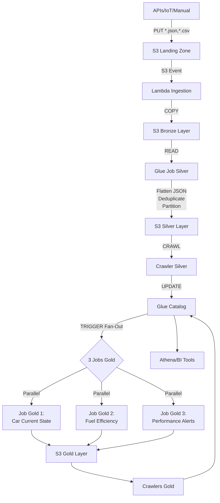

# 🚗 Car Lakehouse - Data Pipeline

**Pipeline de dados de telemetria veicular** implementado na AWS usando arquitetura Medallion (Landing → Bronze → Silver → Gold) com orquestração via AWS Glue Workflow.

**Status**: ✅ **PRODUÇÃO** - Pipeline 100% funcional e validado  
**Ambiente**: Development (dev)  
**Última Atualização**: 06 de Novembro de 2025

---

## 📋 Visão Geral

### Arquitetura Medallion

Este projeto implementa um Data Lakehouse completo para processamento de telemetria veicular, seguindo a arquitetura Medallion:

- **🛬 Landing Zone**: Recebe dados brutos (JSON/CSV) de APIs, dispositivos IoT ou upload manual
- **🥉 Bronze Layer**: Armazena dados copiados do Landing em formato original (validação mínima)
- **🥈 Silver Layer**: Dados limpos, padronizados (snake_case), deduplicated e particionados (Parquet)
- **🥇 Gold Layer**: Agregações de negócio prontas para consumo (dashboards, BI, APIs)

### Componentes Principais

| Componente | Quantidade | Descrição |
|------------|------------|-----------|
| **Buckets S3** | 8 | Landing, Bronze, Silver, Gold, Scripts, Temp, Athena, Layers |
| **Lambda Functions** | 1 ativa | Ingestion (Landing → Bronze) com S3 trigger automático |
| **Glue Jobs** | 4 ativos | 1 Silver + 3 Gold (car state, fuel efficiency, alerts) |
| **Glue Crawlers** | 6 ativos | Bronze, Silver, 3 Gold + schema discovery |
| **Glue Workflow** | 1 | Orquestração Silver→Gold (scheduled daily 02:00 UTC) |
| **Tabelas Catalog** | 5 | 1 Bronze + 1 Silver + 3 Gold |
| **IAM Roles** | 4 | Lambda, Glue Jobs Silver, Gold, Crawlers |

---

## 🏗️ Arquitetura Completa

### Fluxo de Dados End-to-End



### Camadas de Dados

#### 📂 Landing Zone
```
s3://datalake-pipeline-landing-dev/
├── *.json (raw telemetry data)
└── *.csv (batch uploads)

Status: TRANSIENT (arquivos removidos após ingestão)
Trigger: Lambda Ingestion (automático via S3 Event)
```

#### 📂 Bronze Layer
```
s3://datalake-pipeline-bronze-dev/
└── bronze/
    └── car_data/
        └── *.json (raw, 1:1 copy from Landing)

Tabela: car_bronze
Formato: JSON (original)
Tamanho: ~29 KB
```

#### 📂 Silver Layer
```
s3://datalake-pipeline-silver-dev/
└── car_telemetry/
    └── event_year=2025/
        └── event_month=11/
            └── event_day=05/
                └── *.parquet (snappy compressed)

Tabela: silver_car_telemetry
Formato: Parquet (56 colunas snake_case)
Particionamento: event_year, event_month, event_day
Tamanho: ~13 KB
```

#### 📂 Gold Layer
```
s3://datalake-pipeline-gold-dev/
├── gold_car_current_state_new/
│   └── *.parquet (1 row per vehicle, latest state)
├── fuel_efficiency_monthly/
│   └── *.parquet (aggregated by car+month)
└── gold_performance_alerts_slim/
    └── *.parquet (alert logs)

Tabelas: gold_car_current_state_new, fuel_efficiency_monthly, performance_alerts_log_slim
Formato: Parquet
Tamanho Total: ~19 KB
```

---

## 📦 Inventário de Componentes

### 1. 🗄️ Glue Data Catalog

#### Database
| Nome | Catalog ID | Descrição |
|------|------------|-----------|
| `datalake-pipeline-catalog-dev` | 901207488135 | Database principal do Lakehouse |

#### Tabelas (5 tabelas ativas)

##### Bronze
- **`bronze_car_data`**: Dados brutos (JSON) copiados do Landing
  - Localização: `s3://datalake-pipeline-bronze-dev/bronze/car_data/`
  - Atualizada por: `datalake-pipeline-bronze-car-data-crawler-dev`

##### Silver
- **`silver_car_telemetry`**: Dados limpos e estruturados (56 colunas)
  - Localização: `s3://datalake-pipeline-silver-dev/car_telemetry/`
  - Formato: Parquet particionado (event_year/month/day)
  - Atualizada por: `datalake-pipeline-silver-crawler-dev`

##### Gold
- **`gold_car_current_state_new`**: Estado atual de cada veículo (12 colunas)
  - Join de telemetria + dados estáticos + status de seguro
- **`fuel_efficiency_monthly`**: Métricas de eficiência de combustível (7 colunas)
  - Agregação mensal por veículo (km/litro, distância, consumo)
- **`performance_alerts_log_slim`**: Log de alertas de performance
  - Anomalias baseadas em thresholds (temperatura, pressão, bateria)

### 2. 🚀 Glue Jobs

#### Job Silver
**`datalake-pipeline-silver-consolidation-dev`**
- **Função**: Bronze → Silver (limpeza e estruturação)
- **Script**: `glue_jobs/silver_consolidation_job.py`
- **Workers**: 2 × G.1X (Glue 4.0)
- **Transformações**:
  - Flatten nested JSON (metrics.trip.* → trip_*)
  - Convert camelCase → snake_case (56 campos)
  - Deduplicate por event_id (Window function)
  - Particionar por data (year/month/day)
  - Adicionar processing_timestamp
- **Duração média**: 78s
- **Status**: ✅ ATIVO (parte do workflow)

#### Jobs Gold (3 paralelos)

**1. `datalake-pipeline-gold-car-current-state-dev`**
- **Função**: Último estado de cada veículo
- **Transformações**:
  - Window: last_value over partition by car_chassis
  - Join telemetry + static info
  - Calcular status de seguro (válido/expirado)
- **Duração média**: 91s

**2. `datalake-pipeline-gold-fuel-efficiency-dev`**
- **Função**: Eficiência de combustível mensal
- **Transformações**:
  - Extrair year/month de event_date
  - GroupBy car_chassis + year + month
  - Calcular: avg_fuel_efficiency (km/litro)
  - Somar: trip_distance_km, trip_fuel_consumed_liters
- **Duração média**: 93s

**3. `datalake-pipeline-gold-performance-alerts-slim-dev`**
- **Função**: Alertas de performance
- **Transformações**:
  - Check thresholds (temp, pressão, bateria)
  - Flag anomalias
  - Gerar alert records
- **Duração média**: 106s

### 3. 🔍 Glue Crawlers (6 ativos)

| Crawler | Camada | S3 Path | Tabela Criada |
|---------|--------|---------|---------------|
| `datalake-pipeline-bronze-car-data-crawler-dev` | Bronze | `bronze/car_data/` | `bronze_car_data` |
| `datalake-pipeline-silver-crawler-dev` | Silver | `car_telemetry/` | `silver_car_telemetry` |
| `gold_car_current_state_crawler` | Gold | `gold_car_current_state_new/` | `gold_car_current_state_new` |
| `datalake-pipeline-gold-fuel-efficiency-crawler-dev` | Gold | `fuel_efficiency_monthly/` | `fuel_efficiency_monthly` |
| `datalake-pipeline-gold-performance-alerts-slim-crawler-dev` | Gold | `gold_performance_alerts_slim/` | `performance_alerts_log_slim` |
| `gold_alerts_slim_crawler` | Gold | `performance_alerts_log_slim/` | `performance_alerts_log_slim` |

### 4. 🪣 Buckets S3 (8 buckets)

| Bucket | Camada | Propósito | Tamanho |
|--------|--------|-----------|---------|
| `datalake-pipeline-landing-dev` | Landing | Recebe uploads (JSON/CSV) | 0 bytes (transient) |
| `datalake-pipeline-bronze-dev` | Bronze | Raw data (1:1 copy) | ~29 KB |
| `datalake-pipeline-silver-dev` | Silver | Cleaned & partitioned | ~13 KB |
| `datalake-pipeline-gold-dev` | Gold | Business aggregations | ~19 KB |
| `datalake-pipeline-glue-scripts-dev` | Operacional | Job scripts (Python) | ~100 KB |
| `datalake-pipeline-glue-temp-dev` | Operacional | Temp files | Temporário |
| `datalake-pipeline-athena-results-dev` | Analytics | Query results | ~50 KB |
| `datalake-pipeline-lambda-layers-dev` | Operacional | Lambda layers | ~20 MB |

### 5. 🔄 Workflow Glue

**`datalake-pipeline-silver-gold-workflow-dev`**
- **Scheduled Start**: Diário às 02:00 UTC (cron: `0 2 * * ? *`)
- **Duração média**: ~12 minutos
- **Actions**: 8 (1 job silver + 1 crawler silver + 3 jobs gold + 3 crawlers gold)
- **Status**: ✅ 100% success rate (última execução)

**Triggers (6 total):**
1. **Scheduled Start** → Silver Job
2. **Silver Job SUCCEEDED** → Silver Crawler
3. **Silver Crawler SUCCEEDED** → Fan-Out (3 Gold Jobs em paralelo)
4. **Gold Job 1 SUCCEEDED** → Gold Crawler 1
5. **Gold Job 2 SUCCEEDED** → Gold Crawler 2
6. **Gold Job 3 SUCCEEDED** → Gold Crawler 3

### 6. 🔌 Lambda Functions

**`datalake-pipeline-ingestion-dev`** (ATIVA)
- **Runtime**: Python 3.9 (512 MB, 120s timeout)
- **Trigger**: S3 Event (Landing bucket)
  - Eventos: `s3:ObjectCreated:*` (*.json, *.csv)
- **Função**: Copiar Landing → Bronze + cleanup Landing
- **Role**: `datalake-pipeline-lambda-execution-role-dev`
- **Status**: ✅ ATIVA (últimas execuções: 5 invocações)

> **Nota**: Pipeline completamente migrado para AWS Glue. Processamento Bronze→Silver→Gold é feito por Glue Jobs.

### 7. 🔐 IAM Roles (4 roles)

| Role | Usado Por | Principais Permissões |
|------|-----------|------------------------|
| `datalake-pipeline-lambda-execution-role-dev` | Lambda Ingestion | S3 (Landing read, Bronze write), CloudWatch Logs |
| `datalake-pipeline-glue-job-role-dev` | Job Silver | S3 (Bronze read, Silver write), Glue Catalog, CloudWatch |
| `datalake-pipeline-gold-job-role-dev` | Jobs Gold (3) | S3 (Silver read, Gold write/delete), Glue Catalog |
| `datalake-pipeline-glue-crawler-role-dev` | Crawlers (6) | S3 read (all layers), Glue Catalog write |

---

## 🔗 Matriz de Comunicação

| Origem | Ação | Destino | Dados Transferidos |
|--------|------|---------|-------------------|
| APIs/IoT/Manual | S3 PUT | Landing Bucket | JSON/CSV raw files |
| Landing Bucket | S3 Event | Lambda Ingestion | ObjectCreated trigger |
| Lambda Ingestion | S3 COPY | Bronze Bucket | JSON raw (1:1 copy) |
| Lambda Ingestion | S3 DELETE | Landing Bucket | Cleanup após sucesso |
| Bronze Bucket | Glue READ | Job Silver | bronze_car_data table |
| Job Silver | S3 WRITE | Silver Bucket | Parquet particionado |
| Silver Bucket | Glue CRAWL | Crawler Silver | car_telemetry/ folders |
| Crawler Silver | Catalog UPDATE | Glue Catalog | silver_car_telemetry + partitions |
| Glue Catalog | Glue READ | Jobs Gold (3×) | silver_car_telemetry (56 cols) |
| Jobs Gold | S3 WRITE | Gold Bucket | gold_* tables (Parquet) |
| Gold Bucket | Glue CRAWL | Crawlers Gold (3×) | gold_*/ folders |
| Crawlers Gold | Catalog UPDATE | Glue Catalog | gold_* tables |
| Glue Catalog | Athena QUERY | Athena | SQL results → Results Bucket |
| Workflow | TRIGGER | Job Silver | Scheduled (cron) |
| Workflow | TRIGGER | Crawler Silver | Conditional (Job SUCCEEDED) |
| Workflow | TRIGGER | Jobs Gold (3×) | Conditional (Crawler SUCCEEDED) |

---

## 📊 Fluxo de Dados Detalhado

### Stage 1: Ingestão (Landing → Bronze)

```
┌────────────────────────┐
│  External Sources      │
│  • REST APIs           │
│  • IoT Devices         │
│  • Manual Upload       │
└───────────┬────────────┘
            │ PUT *.json, *.csv
            ▼
┌────────────────────────┐
│  S3 Landing Zone       │
│  Status: TRANSIENT     │
└───────────┬────────────┘
            │ S3 ObjectCreated Event
            ▼
┌─────────────────────────────────┐
│  Lambda Ingestion               │
│  • Validate file extension      │
│  • COPY Landing → Bronze         │
│  • DELETE from Landing          │
│  Duration: ~1-5s per file       │
└───────────┬─────────────────────┘
            │ S3 COPY
            ▼
┌────────────────────────┐
│  S3 Bronze Layer       │
│  bronze/car_data/*.json│
│  Status: PERMANENT     │
└────────────────────────┘
```

### Stage 2: Consolidação (Bronze → Silver)

```
┌────────────────────────┐
│  S3 Bronze Layer       │
│  Table: bronze_car_data│
└───────────┬────────────┘
            │ Glue READ (via Catalog)
            ▼
┌──────────────────────────────────────┐
│  Glue Job: Silver Consolidation      │
│  • Flatten JSON (nested → flat)      │
│  • Rename: camelCase → snake_case    │
│  • Deduplicate (Window + row_number) │
│  • Add processing_timestamp          │
│  • Partition by event_date           │
│  • Convert to Parquet (Snappy)       │
│  Duration: ~78s                      │
└───────────┬──────────────────────────┘
            │ S3 WRITE (Parquet)
            ▼
┌────────────────────────────────┐
│  S3 Silver Layer               │
│  car_telemetry/                │
│    event_year=YYYY/            │
│      event_month=MM/           │
│        event_day=DD/           │
│          *.parquet             │
└───────────┬────────────────────┘
            │ Glue CRAWL
            ▼
┌────────────────────────────────┐
│  Glue Catalog                  │
│  Table: silver_car_telemetry   │
│  Schema: 56 cols (snake_case)  │
│  Partitions: registered        │
└────────────────────────────────┘
```

### Stage 3: Agregações (Silver → Gold)

```
┌────────────────────────────────┐
│  Glue Catalog                  │
│  silver_car_telemetry          │
└───────────┬────────────────────┘
            │ Workflow TRIGGER (Fan-Out)
            ▼
     ┌──────┴──────┬──────────────┐
     ▼             ▼              ▼
┌─────────┐  ┌──────────┐  ┌─────────────┐
│ Gold    │  │ Gold     │  │ Gold        │
│ Job 1   │  │ Job 2    │  │ Job 3       │
│ Current │  │ Fuel     │  │ Alerts      │
│ State   │  │ Effic.   │  │ Slim        │
└────┬────┘  └────┬─────┘  └──────┬──────┘
     │            │                │
     │ WRITE      │ WRITE          │ WRITE
     ▼            ▼                ▼
┌────────────────────────────────────┐
│  S3 Gold Layer                     │
│  ├── gold_car_current_state_new/   │
│  ├── fuel_efficiency_monthly/      │
│  └── performance_alerts_slim/      │
└───────────┬────────────────────────┘
            │ Glue CRAWL (3× parallel)
            ▼
┌────────────────────────────────────┐
│  Glue Catalog (Gold Tables)        │
│  • gold_car_current_state_new      │
│  • fuel_efficiency_monthly         │
│  • performance_alerts_log_slim     │
└───────────┬────────────────────────┘
            │ Athena QUERY
            ▼
┌────────────────────────────────────┐
│  Analytics & BI                    │
│  • Athena SQL Queries              │
│  • PowerBI / QuickSight            │
│  • API Endpoints                   │
└────────────────────────────────────┘
```

---

## 📁 Estrutura do Projeto

```
.
├── terraform/                           # Infraestrutura como Código
│   ├── provider.tf                      # Configuração AWS Provider
│   ├── variables.tf                     # Definição de variáveis
│   ├── s3.tf                            # Buckets S3 (8 buckets)
│   ├── lambda.tf                        # Lambda Ingestion + Layer
│   ├── iam.tf                           # Roles e Policies IAM (4 roles)
│   ├── glue.tf                          # Crawler Bronze, Database Catalog
│   ├── glue_silver.tf                   # Job Silver + Crawler Silver
│   ├── glue_gold_car_current_state.tf   # Job Gold 1 + Crawler
│   ├── glue_gold_fuel_efficiency.tf     # Job Gold 2 + Crawler
│   ├── glue_gold_alerts_slim.tf         # Job Gold 3 + Crawler
│   ├── glue_workflow.tf                 # Workflow + 6 Triggers
│   └── outputs.tf                       # Outputs Terraform
├── glue_jobs/                           # Scripts Python dos Glue Jobs
│   ├── silver_consolidation_job.py      # Bronze → Silver (56 cols)
│   ├── gold_car_current_state_job.py    # Silver → Gold 1 (12 cols)
│   ├── gold_fuel_efficiency_job.py      # Silver → Gold 2 (7 cols)
│   └── gold_performance_alerts_slim_job.py  # Silver → Gold 3 (alerts)
├── lambdas/                             # Código das Lambdas
│   └── ingestion/
│       ├── lambda_function.py           # Lambda Ingestion (ativa)
│       └── README.md                    # Documentação técnica
├── docs/                                # Documentação do Projeto
│   └── reports/                         # Relatórios organizados
│       ├── END_TO_END_TEST_REPORT.md
│       ├── EXECUTIVE_SUMMARY.md
│       ├── GOLD_LAYER_VALIDATION_REPORT.md
│       ├── INVENTARIO_AWS.md
│       ├── INVENTARIO_COMPONENTES_ATUALIZADO.md
│       ├── INVENTARIO_INFRAESTRUTURA.md
│       ├── RECOVERY_README.md
│       ├── REFACTORING_SUMMARY.md
│       ├── Relatorio_Componentes_Lakehouse.md
│       └── WORKFLOW_RECOVERY_GUIDE.md
├── scripts/                             # Scripts auxiliares
├── test_data/                           # Dados de teste
├── Data_Model/                          # Modelos de dados
│   └── car_raw.json                     # Schema exemplo
├── assets/                              # Arquivos auxiliares
├── build_lambda.ps1                     # Build Lambda (Windows)
├── build_lambda.sh                      # Build Lambda (Linux/Mac)
├── build_layer_docker.ps1               # Build Layer com Docker
├── terraform.tfvars                     # Variáveis Terraform (privado)
├── .gitignore                           # Git ignore rules
├── QUICK_REFERENCE.md                   # Referência rápida
└── README.md                            # Este arquivo
```

---

## 🚀 Como Usar

### Pré-requisitos

1. **Terraform** >= 1.0
   ```bash
   terraform version
   ```

2. **AWS CLI** configurado
   ```bash
   aws configure
   ```

3. **Credenciais AWS** com permissões para criar:
   - S3 Buckets, Lambda Functions, Glue (Jobs, Crawlers, Workflow)
   - IAM Roles e Policies, CloudWatch Log Groups

### Instalação e Deploy

#### 1. Clonar o repositório
```bash
git clone https://github.com/petersonvm/car-lakehouse.git
cd car-lakehouse
```

#### 2. Build da Lambda Ingestion (OBRIGATÓRIO antes do Terraform)

**Windows (PowerShell):**
```powershell
.\build_lambda.ps1
```

**Linux/Mac:**
```bash
chmod +x build_lambda.sh
./build_lambda.sh
```

Isso criará:
- `assets/ingestion_package.zip` (código da Lambda)
- `assets/pandas_pyarrow_layer.zip` (Lambda Layer)

#### 3. Configurar variáveis

Navegue até o diretório Terraform:
```bash
cd terraform
```

Copie o arquivo de exemplo (se existir) ou edite diretamente `terraform.tfvars`:
```hcl
aws_region   = "us-east-1"
project_name = "datalake-pipeline"
environment  = "dev"

common_tags = {
  Project     = "Car-Lakehouse"
  ManagedBy   = "Terraform"
  Environment = "dev"
}
```

#### 4. Inicializar e aplicar Terraform

```bash
# Inicializar backend e providers
terraform init

# Validar configuração
terraform validate

# Ver plano de execução
terraform plan

# Aplicar (criar recursos)
terraform apply
```

Digite `yes` quando solicitado.

#### 5. Verificar outputs

```bash
terraform output
```

Você verá informações sobre:
- Buckets S3 criados (8)
- Lambda Ingestion ARN
- Glue Database e tabelas
- Workflow ARN

---

## 🧪 Testar o Pipeline

### 1. Upload de arquivo JSON para o Landing Zone

```bash
# Fazer upload de dados de teste
aws s3 cp test_data/sample_car_data.json s3://datalake-pipeline-landing-dev/

# Verificar logs da Lambda Ingestion
aws logs tail /aws/lambda/datalake-pipeline-ingestion-dev --follow
```

A Lambda será invocada automaticamente e copiará o arquivo para Bronze.

### 2. Verificar arquivo no Bronze

```bash
aws s3 ls s3://datalake-pipeline-bronze-dev/bronze/car_data/ --recursive
```

### 3. Executar manualmente o Job Silver (opcional - ou esperar pelo scheduled trigger)

```bash
aws glue start-job-run --job-name datalake-pipeline-silver-consolidation-dev
```

### 4. Executar o Workflow completo

```bash
# Executar workflow manualmente
aws glue start-workflow-run --name datalake-pipeline-silver-gold-workflow-dev

# Verificar status
aws glue get-workflow-run --name datalake-pipeline-silver-gold-workflow-dev --run-id <RUN_ID>
```

O workflow executará:
1. Job Silver (78s)
2. Crawler Silver (atualizar partições)
3. 3 Jobs Gold em paralelo (91s, 93s, 106s)
4. 3 Crawlers Gold (atualizar tabelas)

**Duração total**: ~12 minutos

### 5. Consultar dados com Athena

```sql
-- Verificar tabela Silver
SELECT * FROM "datalake-pipeline-catalog-dev"."silver_car_telemetry"
LIMIT 10;

-- Verificar estado atual dos veículos
SELECT * FROM "datalake-pipeline-catalog-dev"."gold_car_current_state_new";

-- Verificar eficiência de combustível
SELECT 
    car_chassis,
    year,
    month,
    avg_fuel_efficiency_km_per_liter,
    total_distance_km
FROM "datalake-pipeline-catalog-dev"."fuel_efficiency_monthly"
ORDER BY year DESC, month DESC;

-- Verificar alertas de performance
SELECT * FROM "datalake-pipeline-catalog-dev"."performance_alerts_log_slim"
WHERE alert_type = 'HIGH_TEMPERATURE'
LIMIT 100;
```

---

## 📊 Schema dos Dados

### Silver Layer: `silver_car_telemetry` (56 colunas)

```python
# Identificação do Veículo
car_chassis: string
manufacturer: string
model: string
manufacturing_year: bigint
purchase_date: string

# Dados do Proprietário
owner_name: string
owner_cpf: string
owner_email: string
owner_phone: string

# Seguro
insurance_company: string
insurance_policy_number: string
insurance_valid_until: string

# Telemetria Geral
telemetry_timestamp: timestamp
current_mileage_km: bigint
location_latitude: double
location_longitude: double
location_city: string
location_state: string

# Viagem (Trip)
trip_distance_km: double
trip_duration_minutes: bigint
trip_average_speed_km_h: double
trip_fuel_consumed_liters: double

# Motor (Engine)
engine_temperature_c: bigint
engine_rpm: bigint
engine_load_percent: bigint
engine_coolant_temp_c: bigint

# Bateria
battery_voltage_v: double
battery_charge_percent: bigint

# Pneus (Tires)
tire_pressure_front_left_psi: bigint
tire_pressure_front_right_psi: bigint
tire_pressure_rear_left_psi: bigint
tire_pressure_rear_right_psi: bigint

# Sensores
odometer_reading_km: bigint
fuel_level_percent: bigint
ambient_temperature_c: bigint

# Eventos e Alertas
event_id: string (PK)
event_date: string
event_year: bigint (partition)
event_month: bigint (partition)
event_day: bigint (partition)

# Metadados
processing_timestamp: timestamp
```

### Gold Layer 1: `gold_car_current_state_new` (12 colunas)

```python
car_chassis: string
manufacturer: string
model: string
manufacturing_year: bigint
owner_name: string
current_mileage_km: bigint
fuel_level_percent: bigint
battery_voltage_v: double
insurance_company: string
insurance_valid_until: string
insurance_status: string  # "VALID" or "EXPIRED"
last_telemetry_timestamp: timestamp
```

### Gold Layer 2: `fuel_efficiency_monthly` (7 colunas)

```python
car_chassis: string
year: bigint
month: bigint
total_distance_km: double
total_fuel_consumed_liters: double
number_of_trips: bigint
avg_fuel_efficiency_km_per_liter: double
```

---

## 🔐 Segurança

- **✅ Criptografia**: Todos os buckets S3 usam AES256
- **✅ Acesso Público**: Bloqueado por padrão em todos os buckets
- **✅ Versionamento**: Habilitado nos buckets principais
- **✅ IAM**: Princípio do menor privilégio (least privilege)
- **✅ CloudWatch Logs**: Habilitado para todas as execuções
- **✅ Job Bookmarks**: Habilitado no Job Silver (evita reprocessamento)

---

## 📈 Monitoramento e Observabilidade

### CloudWatch Log Groups

```bash
# Lambda Ingestion
/aws/lambda/datalake-pipeline-ingestion-dev

# Glue Jobs
/aws/glue/jobs/datalake-pipeline-silver-consolidation-dev
/aws/glue/jobs/datalake-pipeline-gold-car-current-state-dev
/aws/glue/jobs/datalake-pipeline-gold-fuel-efficiency-dev
/aws/glue/jobs/datalake-pipeline-gold-performance-alerts-slim-dev

# Crawlers
/aws/glue/crawlers
```

### Métricas Principais

| Métrica | Namespace | Descrição |
|---------|-----------|-----------|
| `Duration` | Lambda | Tempo de execução da Lambda Ingestion |
| `Errors` | Lambda | Erros na Lambda Ingestion |
| `glue.driver.aggregate.numCompletedStages` | Glue | Estágios completados nos Jobs |
| `glue.driver.aggregate.numFailedTasks` | Glue | Tarefas falhadas nos Jobs |

### Consultar Execuções Recentes

```bash
# Workflow runs
aws glue get-workflow-runs --name datalake-pipeline-silver-gold-workflow-dev --max-results 5

# Job runs (Silver)
aws glue get-job-runs --job-name datalake-pipeline-silver-consolidation-dev --max-results 5

# Crawler runs
aws glue get-crawler-metrics --crawler-name-list datalake-pipeline-silver-crawler-dev
```

---

## 💰 Estimativa de Custos (Desenvolvimento)

| Serviço | Uso Mensal | Custo Estimado |
|---------|------------|----------------|
| **S3 Storage** | ~200 KB | < $0.01 |
| **Lambda Invocations** | ~100 invocations | < $0.01 |
| **Glue Jobs** | 30 runs × 4 jobs × 2 min | ~$1.20 |
| **Glue Crawlers** | 30 runs × 6 crawlers | ~$0.50 |
| **Athena Queries** | ~1 TB scanned | ~$5.00 |
| **CloudWatch Logs** | 1 GB | ~$0.50 |
| **Total Estimado** | | **~$7.21/mês** |

> **Nota**: Custos reais variam conforme o volume de dados e frequência de execução.

---

## 🧹 Otimização de Infraestrutura

### Limpeza de Recursos Legados

O pipeline atual contém ~10 recursos legados (órfãos de refatorações anteriores) que podem ser removidos para otimização de custos:

**Recursos Identificados:**
- 3 Lambdas não utilizadas (cleansing, analysis, compliance)
- 2 Crawlers duplicados (gold_alerts_slim, gold_fuel_efficiency)
- 1 IAM Role órfã + 3 policies associadas

**Economia Estimada:** ~$0.50/mês + redução de 7% na complexidade do Terraform

**Como Executar a Limpeza:**

```bash
# 1. Revisar plano detalhado
cat docs/TERRAFORM_CLEANUP_PLAN.md

# 2. Simular limpeza (DRY RUN - não faz alterações)
.\scripts\cleanup_legacy_resources.ps1 -DryRun

# 3. Executar limpeza REAL (com backup automático)
.\scripts\cleanup_legacy_resources.ps1

# 4. Validar pipeline após limpeza
aws glue start-workflow-run --name datalake-pipeline-silver-gold-workflow-dev
```

**Documentação Completa:**
- **[docs/TERRAFORM_CLEANUP_PLAN.md](./docs/TERRAFORM_CLEANUP_PLAN.md)**: Plano detalhado de limpeza
- **[scripts/cleanup_legacy_resources.ps1](./scripts/cleanup_legacy_resources.ps1)**: Script automatizado

> **✅ Seguro**: Script inclui backup automático do Terraform state e modo DRY RUN para simulação.

---

## 🗑️ Destruir Recursos (Remover Tudo)

Para remover **TODOS** os recursos criados:

```bash
cd terraform
terraform destroy
```

⚠️ **ATENÇÃO**: 
- Faça backup dos dados S3 antes de destruir!
- Buckets com versionamento requerem remoção manual de todas as versões

---

## 📚 Documentação Adicional

Para informações mais detalhadas, consulte:

- **[QUICK_REFERENCE.md](./QUICK_REFERENCE.md)**: Comandos rápidos e referências
- **[docs/TERRAFORM_CLEANUP_PLAN.md](./docs/TERRAFORM_CLEANUP_PLAN.md)**: 🧹 Plano de limpeza de recursos legados
- **[docs/reports/INVENTARIO_COMPONENTES_ATUALIZADO.md](./docs/reports/INVENTARIO_COMPONENTES_ATUALIZADO.md)**: Inventário completo detalhado
- **[docs/reports/END_TO_END_TEST_REPORT.md](./docs/reports/END_TO_END_TEST_REPORT.md)**: Relatório de testes end-to-end
- **[docs/reports/WORKFLOW_RECOVERY_GUIDE.md](./docs/reports/WORKFLOW_RECOVERY_GUIDE.md)**: Guia de recuperação do workflow
- **[test_data/README.md](./test_data/README.md)**: 🧪 Guia de dados de teste

---

## 🛠️ Troubleshooting

### Lambda Ingestion não é invocada

1. Verificar se S3 Event Notifications estão configurados:
   ```bash
   aws s3api get-bucket-notification-configuration --bucket datalake-pipeline-landing-dev
   ```

2. Verificar permissões da Lambda:
   ```bash
   aws lambda get-policy --function-name datalake-pipeline-ingestion-dev
   ```

### Job Silver falha

1. Verificar se tabela Bronze existe:
   ```bash
   aws glue get-table --database-name datalake-pipeline-catalog-dev --name bronze_car_data
   ```

2. Verificar logs do Job:
   ```bash
   aws logs tail /aws/glue/jobs/datalake-pipeline-silver-consolidation-dev --follow
   ```

### Workflow não inicia

1. Verificar se trigger está habilitado:
   ```bash
   aws glue get-triggers --query "Triggers[?WorkflowName=='datalake-pipeline-silver-gold-workflow-dev']"
   ```

2. Iniciar manualmente:
   ```bash
   aws glue start-workflow-run --name datalake-pipeline-silver-gold-workflow-dev
   ```

---

## 🤝 Contribuição

Contribuições são bem-vindas! Por favor:
1. Fork o projeto
2. Crie uma branch para sua feature (`git checkout -b feature/AmazingFeature`)
3. Commit suas mudanças (`git commit -m 'Add some AmazingFeature'`)
4. Push para a branch (`git push origin feature/AmazingFeature`)
5. Abra um Pull Request

---

## 📄 Licença

Este projeto é fornecido como exemplo educacional para demonstração de arquitetura de Data Lakehouse na AWS.

---

## 👥 Autores

- **Peterson VM** - [GitHub](https://github.com/petersonvm)

---

## 🙏 Agradecimentos

- AWS Glue Documentation
- Databricks Medallion Architecture
- Terraform AWS Provider Community

---

**Desenvolvido com ❤️ usando Terraform, AWS Glue e Python**
