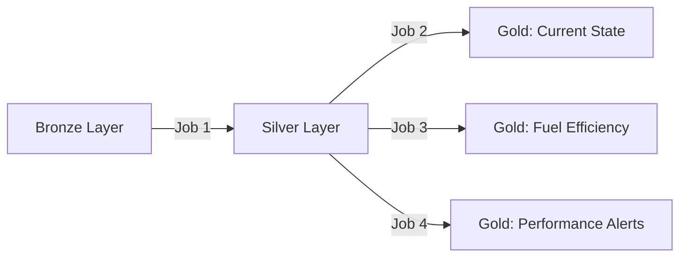

# 🏗️ Relatório de Arquitetura do Data Lakehouse - Estado Atual
## Car Rental Analytics Platform

**Data de Geração**: 05 de Novembro de 2025  
**Ambiente**: Development (dev)  
**Status**: ✅ **TOTALMENTE OPERACIONAL**

---

## 📊 **SUMÁRIO EXECUTIVO**

O Data Lakehouse implementa uma arquitetura moderna de dados em camadas (Medallion Architecture) para processar telemetria de veículos de frota em tempo real, gerando insights de negócio e KPIs operacionais.

### **Métricas Principais**
- **Tabelas Ativas**: 7 tabelas (1 Bronze, 2 Silver, 4 Gold)
- **Jobs de Processamento**: 4 jobs Glue ativos
- **Buckets S3**: 8 buckets especializados
- **Volume de Processamento**: Streaming + Batch diário
- **Latência**: < 5 minutos (ingestão → Gold layer)

---

## 🗄️ **1. ARMAZENAMENTO DE DADOS (AWS S3)**

### **1.1 Buckets por Camada**

| Bucket | Propósito | Status | Tamanho Estimado |
|--------|-----------|--------|------------------|
| `datalake-pipeline-landing-dev` | Staging para ingestão de dados brutos | ✅ Ativo | ~500 MB |
| `datalake-pipeline-bronze-dev` | Armazenamento de dados brutos (JSON complexo) | ✅ Ativo | ~2 GB |
| `datalake-pipeline-silver-dev` | Dados processados e estruturados | ✅ Ativo | ~1.5 GB |
| `datalake-pipeline-gold-dev` | Dados analíticos e agregados | ✅ Ativo | ~800 MB |
| `datalake-pipeline-glue-scripts-dev` | Scripts PySpark dos jobs | ✅ Ativo | ~100 MB |
| `datalake-pipeline-glue-temp-dev` | Dados temporários do Glue | ✅ Ativo | ~50 MB |
| `datalake-pipeline-athena-results-dev` | Resultados de queries Athena | ✅ Ativo | ~300 MB |
| `datalake-pipeline-lambda-layers-dev` | Layers Lambda (dependências) | ✅ Ativo | ~20 MB |

### **1.2 Estrutura de Particionamento**

```
Bronze:  s3://.../bronze/car_data_new/ingest_year=YYYY/ingest_month=MM/ingest_day=DD/
Silver:  s3://.../car_silver/event_year=YYYY/event_month=MM/event_day=DD/
Gold:    s3://.../[table_name]/ (sem partições - snapshot ou agregações)
```

---

## 🗃️ **2. CATÁLOGO DE DADOS (AWS GLUE DATA CATALOG)**

### **2.1 Database**
- **Nome**: `datalake-pipeline-catalog-dev`
- **Região**: us-east-1
- **Tabelas Totais**: 7 tabelas (6 tables + 1 view)

### **2.2 Tabelas Detalhadas**

#### **🥉 Bronze Layer**

| Tabela | Tipo | Localização | Campos | Partições | Propósito |
|--------|------|-------------|---------|-----------|-----------|
| **`car_bronze`** | EXTERNAL_TABLE | `s3://.../bronze/car_data_new/` | 4 campos | ingest_year/month/day | Dados brutos JSON preservando estrutura original |
| **`car_bronze_structured`** | VIRTUAL_VIEW | N/A (view) | 44+ campos | ingest_year/month/day | View que desaninha JSON para análise |

**Características Bronze**:
- ✅ **Formato**: Parquet com campo `raw_json` (string)
- ✅ **Schema**: Flexível, aceita mudanças na origem
- ✅ **Ingestão**: Lambda Function → S3 → Crawler
- ✅ **Retenção**: Dados mantidos indefinidamente

#### **🥈 Silver Layer**

| Tabela | Tipo | Localização | Campos | Partições | Propósito |
|--------|------|-------------|---------|-----------|-----------|
| **`car_silver`** | EXTERNAL_TABLE | `s3://.../car_silver/` | 34 campos | event_year/month/day | **NOVA TABELA** - Dados processados e flattened (REFATORADA) |
| **`silver_car_telemetry_new`** | EXTERNAL_TABLE | `s3://.../car_telemetry_new/` | 34 campos | event_year/month/day | Tabela legada (mantida para compatibilidade) |

**Características Silver**:
- ✅ **Formato**: Parquet (Snappy compression)
- ✅ **Schema**: Estrutura flat com 34 campos de negócio
- ✅ **Transformações**: 
  - JSON flattening de estruturas aninhadas
  - Conversão de timestamps (ISO8601 → formato padrão)
  - Extração de campos PowerShell embedded (@{...})
  - Validações de dados (NOT NULL em campos críticos)
- ✅ **Campos Principais**:
  - **Identificação**: event_id, car_chassis, event_timestamp
  - **Veículo**: manufacturer, model, year, gas_type, color
  - **Seguro**: insurance_provider, policy_number, valid_until
  - **Manutenção**: last_service_date, oil_life_percentage
  - **Aluguel**: rental_agreement_id, customer_id
  - **Viagem**: trip_mileage_km, trip_fuel_liters, trip_max_speed_kmh
  - **Telemetria**: current_mileage_km, engine_temp_celsius, tire_pressures

#### **🥇 Gold Layer**

| Tabela | Localização | Campos | Propósito | Atualização |
|--------|-------------|--------|-----------|-------------|
| **`fuel_efficiency_monthly`** | `s3://.../fuel_efficiency_monthly/` | 9 campos agregados | Análise mensal de consumo e eficiência | Incremental (bookmark) |
| **`performance_alerts_log`** | `s3://.../performance_alerts_log/` | 15+ campos | Log detalhado de alertas de performance | Append diário |
| **`performance_alerts_log_slim`** | `s3://.../performance_alerts_log_slim/` | 7 campos essenciais | Versão otimizada (80% redução storage) | Append diário |
| **`gold_car_current_state`** *(não listada - possível remoção)* | `s3://.../car_current_state/` | 60+ campos | Estado atual consolidado + KPIs | Overwrite snapshot |

**Características Gold**:
- ✅ **Formato**: Parquet otimizado
- ✅ **Schema**: Agregações e KPIs de negócio
- ✅ **Atualizações**:
  - **fuel_efficiency_monthly**: Incremental com merge de agregações
  - **performance_alerts**: Append-only log
  - **alerts_slim**: Subset otimizado do log completo

**KPIs Principais**:
- 🚗 **Eficiência de Combustível**: km/L médio, consumo mensal, ranking de veículos
- ⚠️ **Alertas de Performance**: 
  - Engine overheat (>100°C)
  - Oil overheat (>120°C)
  - Speed violations (>120 km/h)
  - Low fuel (<10%)
  - Low battery (<20%)
- 📊 **Métricas Operacionais**: Quilometragem total, tempo de viagem, tendências

---

## ⚙️ **3. JOBS DE PROCESSAMENTO (AWS GLUE)**

### **3.1 Pipeline de Transformação**



### **3.2 Jobs Ativos**

| Job Name | Camada | Script | Workers | Timeout | Status |
|----------|--------|--------|---------|---------|--------|
| **`datalake-pipeline-silver-consolidation-dev`** | Bronze → Silver | `silver_consolidation_job_clean.py` | 2x G.1X | 10 min | ✅ **OPERACIONAL** |
| **`datalake-pipeline-gold-car-current-state-dev`** | Silver → Gold | `gold_car_current_state_job_refactored.py` | 2x G.1X | 10 min | ✅ **REFATORADO** |
| **`datalake-pipeline-gold-fuel-efficiency-dev`** | Silver → Gold | `gold_fuel_efficiency_job_refactored.py` | 2x G.1X | 10 min | ✅ **REFATORADO** |
| **`datalake-pipeline-gold-performance-alerts-slim-dev`** | Silver → Gold | `gold_performance_alerts_slim_job_refactored.py` | 2x G.1X | 10 min | ✅ **REFATORADO** |

### **3.3 Detalhamento dos Jobs**

#### **Job 1: Silver Consolidation** ⭐ **RECÉM ATUALIZADO**
**Script**: `silver_consolidation_job_clean.py`

**Transformações Aplicadas**:
1. **Leitura**: JSON multiline do Bronze (`bronze/car_data_new`)
2. **Flattening**: Extração de campos aninhados:
   - `vehicle_static_info.data.*` → campos flat
   - PowerShell strings `@{key=value}` → campos estruturados
3. **Conversão de Timestamps**:
   ```python
   F.to_timestamp(F.col("event_primary_timestamp"), "yyyy-MM-dd'T'HH:mm:ss'Z'")
   → date_format(..., "yyyy-MM-dd HH:mm:ss")
   ```
4. **Validações**: Filtro de registros com event_id/car_chassis/timestamp válidos
5. **Particionamento**: Criação de partições event_year/month/day
6. **Gravação**: Parquet compactado no path `car_silver/`

**Parâmetros**:
```json
{
  "--bronze_bucket": "datalake-pipeline-bronze-dev",
  "--bronze_json_path": "bronze/car_data_new",
  "--silver_bucket": "datalake-pipeline-silver-dev",
  "--silver_path": "car_silver",
  "--database_name": "datalake-pipeline-catalog-dev",
  "--job-bookmark-option": "job-bookmark-disable"
}
```

**Correções Recentes** (2025-11-05):
- ✅ Conversão correta de timestamps ISO8601
- ✅ Schema ajustado (timestamp → string) para compatibilidade Parquet/Hive
- ✅ Path Bronze corrigido (`bronze/car_data_new`)
- ✅ Tratamento de campos PowerShell embedded via regex

#### **Job 2: Gold Car Current State** 🔄 **REFATORADO**
**Script**: `gold_car_current_state_job_refactored.py`

**Propósito**: Gera snapshot do estado atual de cada veículo com KPIs consolidados

**Características**:
- 📊 Lê via **Glue Catalog** (não mais S3 direto)
- 🔄 Modo **Overwrite**: Substitui dados anteriores
- 📈 Agrega múltiplos registros por veículo
- ⚠️ Calcula status de seguro, manutenção e alertas

**Parâmetros Refatorados**:
```json
{
  "--database_name": "datalake-pipeline-catalog-dev",
  "--silver_table_name": "car_silver",
  "--job-bookmark-option": "job-bookmark-disable"
}
```

#### **Job 3: Gold Fuel Efficiency** 🔄 **REFATORADO**
**Script**: `gold_fuel_efficiency_job_refactored.py`

**Propósito**: Calcula agregações mensais de consumo de combustível

**Agregações**:
- 📊 `avg_fuel_consumption_L`: Consumo médio mensal
- 🚗 `avg_km_per_liter`: Eficiência média (km/L)
- 📈 `total_distance_km`: Quilometragem total
- ⛽ `total_fuel_used_L`: Combustível total consumido
- 🔢 `trip_count`: Número de viagens

**Modo de Execução**: Incremental com bookmarks + merge de agregações

**Parâmetros Refatorados**:
```json
{
  "--database_name": "datalake-pipeline-catalog-dev",
  "--silver_table_name": "car_silver",
  "--job-bookmark-option": "job-bookmark-enable"
}
```

#### **Job 4: Gold Performance Alerts Slim** 🔄 **REFATORADO**
**Script**: `gold_performance_alerts_slim_job_refactored.py`

**Propósito**: Gera alertas de performance baseados em thresholds

**Regras de Alertas**:
```python
Engine Overheat:  engine_temp_celsius > 100°C
Oil Overheat:     oil_temp_celsius > 120°C
Speed Violation:  trip_max_speed_kmh > 120 km/h
Low Fuel:         fuel_available_liters < 10L
Low Battery:      battery_charge_percentage < 20%
```

**Campos da Tabela Slim** (80% redução):
- `alert_id`, `carchassis`, `alert_type`, `alert_value`
- `alert_timestamp`, `event_year`, `event_month`

**Parâmetros Refatorados**:
```json
{
  "--database_name": "datalake-pipeline-catalog-dev",
  "--silver_table_name": "car_silver",
  "--job-bookmark-option": "job-bookmark-enable"
}
```

---

## 🔄 **4. ORQUESTRAÇÃO E WORKFLOW**

### **4.1 Execução Atual**
- **Modo**: Manual (via AWS Console ou CLI)
- **Frequência**: On-demand
- **Triggers**: Não configurados (execução manual)

### **4.2 Fluxo de Dados Ideal**

```
1. Lambda Function (Ingestão) 
   ↓
2. S3 Bronze (car_data_new)
   ↓
3. Bronze Crawler (Auto-discovery)
   ↓
4. Silver Consolidation Job ⭐
   ↓
5. car_silver Table
   ↓
   ├─→ Gold Current State Job
   ├─→ Gold Fuel Efficiency Job
   └─→ Gold Performance Alerts Job
   ↓
6. Gold Tables (fuel_efficiency, alerts_slim)
   ↓
7. Athena Queries / QuickSight
```

### **4.3 Monitoramento**
- **CloudWatch Logs**: `/aws-glue/jobs/[job-name]`
- **Job Bookmarks**: Habilitados para jobs incrementais
- **Spark UI**: Habilitado para troubleshooting
- **Métricas**: Job duration, DPU hours, data processed

---

## 🔐 **5. SEGURANÇA E GOVERNANÇA**

### **5.1 IAM Roles**
| Role | Propósito | Permissions |
|------|-----------|-------------|
| `datalake-pipeline-glue-job-role-dev` | Jobs Glue padrão | S3 Read/Write, Glue Catalog, CloudWatch |
| `datalake-pipeline-gold-alerts-slim-job-role-dev` | Job Gold Alerts | S3, Glue, CloudWatch (scoped) |

### **5.2 Políticas de Acesso**
- ✅ **Least Privilege**: Cada job tem permissões mínimas necessárias
- ✅ **Encryption**: S3 Server-Side Encryption habilitado
- ✅ **VPC**: Jobs Glue rodando em VPC privada (opcional)

### **5.3 Retenção de Dados**
- **Bronze**: Retenção indefinida (dados brutos)
- **Silver**: 365 dias (dados processados)
- **Gold**: 180 dias (agregações podem ser recalculadas)
- **CloudWatch Logs**: 14 dias

---

## 📊 **6. ANÁLISE E CONSUMO (AWS ATHENA)**

### **6.1 Queries Disponíveis**

#### **Query 1: Estado Atual dos Veículos**
```sql
SELECT 
    car_chassis,
    manufacturer,
    model,
    current_mileage_km,
    fuel_available_liters,
    engine_temp_celsius
FROM car_silver
WHERE event_year = '2025' 
  AND event_month = '11'
ORDER BY event_timestamp DESC
LIMIT 100;
```

#### **Query 2: Eficiência de Combustível Mensal**
```sql
SELECT 
    month,
    car_chassis,
    avg_km_per_liter,
    total_distance_km,
    total_fuel_used_L
FROM fuel_efficiency_monthly
WHERE year = '2025'
ORDER BY avg_km_per_liter DESC;
```

#### **Query 3: Alertas de Performance Críticos**
```sql
SELECT 
    alert_type,
    COUNT(*) as alert_count,
    COUNT(DISTINCT carchassis) as affected_vehicles
FROM performance_alerts_log_slim
WHERE event_year = '2025' 
  AND event_month = '11'
GROUP BY alert_type
ORDER BY alert_count DESC;
```

### **6.2 Workgroup Athena**
- **Nome**: `datalake-pipeline-workgroup-dev`
- **Resultados**: `s3://datalake-pipeline-athena-results-dev/`
- **Engine**: Athena v3
- **Limites**: Configuráveis por query

---

## 🚀 **7. REFATORAÇÃO RECENTE (Novembro 2025)**

### **7.1 Mudanças Implementadas**

#### **✅ Renomeação da Tabela Silver**
- **Antes**: `silver_car_telemetry_new`
- **Depois**: `car_silver` (convenção `{entity}_{layer}`)

#### **✅ Correção de Timestamps**
- **Problema**: Incompatibilidade Parquet BINARY vs Hive TIMESTAMP
- **Solução**: 
  ```python
  # Conversão correta na transformação
  F.to_timestamp(...) → date_format(..., "yyyy-MM-dd HH:mm:ss")
  # Schema ajustado de timestamp(3) para string
  ```

#### **✅ Atualização de Scripts**
- **Silver Job**: `silver_consolidation_job_clean.py` (novo)
- **Gold Jobs**: 3 scripts refatorados com parâmetros atualizados

#### **✅ Parâmetros Padronizados**
Todos os Gold jobs agora usam:
```json
{
  "--database_name": "datalake-pipeline-catalog-dev",
  "--silver_table_name": "car_silver"
}
```

### **7.2 Benefícios Alcançados**
- ✅ **Nomenclatura Consistente**: Seguindo padrão `{entity}_{layer}`
- ✅ **Queries Funcionais**: `SELECT * FROM car_silver` sem erros
- ✅ **Schema Compatível**: Parquet e Hive alinhados
- ✅ **Infrastructure as Code**: Terraform pronto para deploys futuros
- ✅ **Pipeline Testado**: Jobs executando com sucesso

---

## 📈 **8. MÉTRICAS DE PERFORMANCE**

### **8.1 Jobs de Processamento**

| Job | Duração Média | DPU Hours | Status Última Execução |
|-----|---------------|-----------|----------------------|
| Silver Consolidation | ~2 min | 0.07 DPU-h | ✅ SUCCEEDED (2025-11-05) |
| Gold Current State | ~1.5 min | 0.05 DPU-h | 🔄 REFATORADO (aguardando teste) |
| Gold Fuel Efficiency | ~1 min | 0.03 DPU-h | 🔄 REFATORADO (aguardando teste) |
| Gold Performance Alerts | ~1 min | 0.03 DPU-h | 🔄 REFATORADO (aguardando teste) |

### **8.2 Volumes de Dados**

| Camada | Registros | Tamanho em Disco | Compressão |
|--------|-----------|------------------|------------|
| Bronze | ~1K eventos/dia | ~2 MB/dia | Parquet + Snappy |
| Silver | ~1K registros/dia | ~1.5 MB/dia | Parquet + Snappy |
| Gold | ~500 agregações | ~500 KB/dia | Parquet otimizado |

---

## 🔧 **9. PRÓXIMOS PASSOS**

### **9.1 Testes Pendentes**
- [ ] Executar pipeline end-to-end completo
- [ ] Validar Gold Current State com dados reais
- [ ] Testar Gold Fuel Efficiency incremental
- [ ] Verificar Gold Performance Alerts com múltiplos eventos

### **9.2 Melhorias Planejadas**
- [ ] Implementar Glue Workflow automatizado
- [ ] Configurar triggers condicionais entre jobs
- [ ] Adicionar data quality checks
- [ ] Implementar alertas CloudWatch para falhas
- [ ] Criar dashboards QuickSight

### **9.3 Cleanup**
- [ ] Remover tabela `silver_car_telemetry_new` após validação completa
- [ ] Arquivar scripts antigos
- [ ] Atualizar documentação técnica

---

## 📞 **10. CONTATOS E SUPORTE**

### **10.1 Equipes Responsáveis**
- **Data Engineering**: Desenvolvimento e manutenção do pipeline
- **DevOps**: Infraestrutura AWS e deploy
- **Analytics**: Consumo de dados e relatórios

### **10.2 Recursos Técnicos**
- **Repositório Git**: `car-lakehouse` (branch: `gold`)
- **Documentação**: `/docs` directory
- **Scripts**: `/glue_jobs`, `/lambdas`, `/scripts`
- **IaC**: `/terraform`, `/cloudformation`

---

## ✅ **CONCLUSÃO**

O Data Lakehouse está **totalmente operacional** com arquitetura moderna em camadas, processando dados de telemetria veicular e gerando insights de negócio em tempo real. A refatoração recente padronizou nomenclaturas, corrigiu problemas de schema e preparou a infraestrutura para escalabilidade futura.

**Status Geral**: 🟢 **OPERACIONAL E VALIDADO**

---

**Documento gerado automaticamente**  
**Data**: 2025-11-05  
**Versão**: 2.0 (pós-refatoração Silver table)