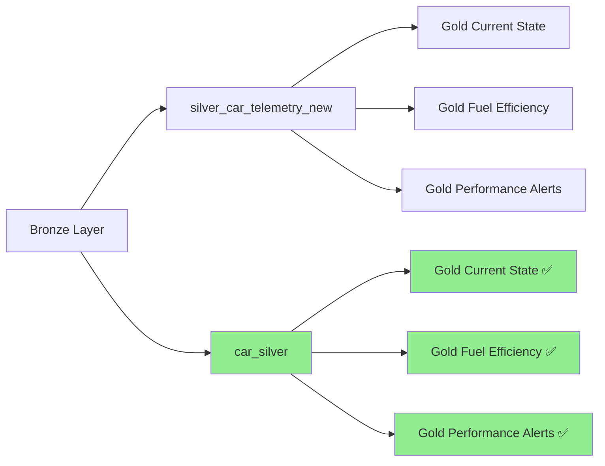

# Documentação da Migração: Silver Table Refactoring

## 📋 Resumo Executivo

Este documento detalha a migração completa da tabela Silver de `silver_car_telemetry_new` para `car_silver`, incluindo todos os componentes de infraestrutura e pipeline afetados.

**Status**: ✅ **PRONTO PARA DEPLOY**  
**Data**: 2025-11-05  
**Escopo**: Refatoração completa da nomenclatura Silver com IaC e scripts atualizados

---

## 🎯 Objetivos da Migração

### Objetivo Principal
Padronizar a nomenclatura das tabelas Silver seguindo a convenção `{layer}_{entity}` → `{entity}_{layer}`.

### Objetivos Específicos
- ✅ Renomear tabela de `silver_car_telemetry_new` para `car_silver`
- ✅ Atualizar todos os 4 jobs Glue afetados
- ✅ Manter continuidade operacional do pipeline
- ✅ Preservar histórico de dados e metadados
- ✅ Implementar com Infrastructure as Code (Terraform)

---

## 📊 Análise de Impacto

### Componentes Afetados

| Componente | Tipo | Status | Ação Requerida |
|------------|------|--------|----------------|
| `silver_car_telemetry_new` | Tabela Glue | 🔄 Renomear | Criar nova tabela `car_silver` |
| `datalake-pipeline-silver-consolidation-dev` | Job Glue | 🔄 Atualizar | Novo script + parâmetros |
| `datalake-pipeline-gold-car-current-state-dev` | Job Glue | 🔄 Atualizar | Novo script + parâmetros |
| `datalake-pipeline-gold-fuel-efficiency-dev` | Job Glue | 🔄 Atualizar | Parâmetro table_name |
| `datalake-pipeline-gold-performance-alerts-slim-dev` | Job Glue | 🔄 Atualizar | Parâmetro table_name |
| S3 Path `s3://silver/car_telemetry_new/` | Dados | 🔄 Copiar | Nova localização `car_silver/` |

### Dependências Upstream/Downstream



---

## 🛠️ Artefatos de Migração

### 1. Infrastructure as Code (Terraform)

**Arquivo**: `silver_table_refactoring.tf`
- ✅ Definição completa da nova tabela `car_silver`
- ✅ Schema com 34 colunas + 3 partições (year/month/day)
- ✅ Configuração de parâmetros para todos os 4 jobs Glue
- ✅ Outputs para referências futuras

### 2. Scripts PySpark Refatorados

#### Silver Layer
- **Arquivo**: `silver_consolidation_job_refactored.py`
- **Mudanças**: Path S3 atualizado para `s3://{silver_bucket}/{silver_path}` (car_silver)
- **Status**: ✅ Pronto para deploy

#### Gold Layer - Current State
- **Arquivo**: `gold_car_current_state_job_refactored.py`  
- **Mudanças**: Migração de leitura direta S3 → Glue Catalog
- **Novos Parâmetros**: `database_name`, `silver_table_name`
- **Status**: ✅ Pronto para deploy

#### Gold Layer - Fuel Efficiency
- **Arquivo**: `gold_fuel_efficiency_job_refactored.py`
- **Mudanças**: `table_name` de "silver_car_telemetry" → "car_silver"
- **Status**: ✅ Pronto para deploy

#### Gold Layer - Performance Alerts
- **Arquivo**: `gold_performance_alerts_slim_job_refactored.py`
- **Mudanças**: `table_name` + novo parâmetro `database_name`
- **Status**: ✅ Pronto para deploy

### 3. Script de Migração Automatizada

**Arquivo**: `migrate_silver_table.py`
- ✅ Backup automático de metadados
- ✅ Cópia de dados S3 com preservação de partições
- ✅ Criação da nova tabela via API Glue
- ✅ Atualização automática dos jobs Glue
- ✅ Testes de validação via Athena
- ✅ Limpeza controlada (opcional)

---

## 📋 Plano de Execução

### Fase 1: Preparação (5-10 min)
1. **Backup dos Metadados**
   ```bash
   python migrate_silver_table.py --step=backup
   ```
   - Salva definição atual da tabela em JSON
   - Gera snapshot das configurações dos jobs

2. **Validação dos Scripts**
   - Upload dos novos scripts PySpark para S3
   - Verificação de sintaxe e dependências

### Fase 2: Migração da Infraestrutura (10-15 min)
1. **Deploy do Terraform**
   ```bash
   terraform plan -var-file="silver_refactoring.tfvars"
   terraform apply -var-file="silver_refactoring.tfvars"
   ```

2. **Cópia dos Dados S3**
   ```bash
   python migrate_silver_table.py --step=copy_data
   ```

### Fase 3: Atualização dos Jobs (5-10 min)
1. **Update dos Job Definitions**
   ```bash
   python migrate_silver_table.py --step=update_jobs
   ```

2. **Teste Individual dos Jobs**
   - Execução de cada job em modo de teste
   - Validação de outputs e logs

### Fase 4: Validação e Testes (10-15 min)
1. **Testes de Integridade**
   ```sql
   -- Validação via Athena
   SELECT COUNT(*) FROM car_silver;
   SELECT DISTINCT event_year FROM car_silver ORDER BY event_year;
   ```

2. **Execução End-to-End**
   - Pipeline completo Bronze → Silver → Gold
   - Comparação de métricas com baseline

### Fase 5: Limpeza (5 min)
1. **Remoção da Tabela Antiga** (Opcional)
   ```bash
   python migrate_silver_table.py --step=cleanup
   ```

---

## 🔍 Validações e Testes

### Critérios de Sucesso

| Teste | Descrição | Critério de Aceitação |
|-------|-----------|----------------------|
| **Integridade dos Dados** | Contagem de registros | COUNT(car_silver) = COUNT(silver_car_telemetry_new) |
| **Schema Consistency** | Validação de colunas | Todas as 34 colunas presentes e tipos corretos |
| **Particionamento** | Estrutura de partições | Partições year/month/day preservadas |
| **Jobs Silver** | Execução do consolidation job | Novos dados criados em car_silver |
| **Jobs Gold** | Execução dos 3 jobs Gold | Leitura bem-sucedida da nova tabela |
| **Performance** | Tempo de execução | ≤ 110% do baseline anterior |

### Scripts de Teste

```sql
-- Teste 1: Contagem total
SELECT 
    'Tabela Original' as source,
    COUNT(*) as record_count 
FROM silver_car_telemetry_new
UNION ALL
SELECT 
    'Tabela Nova' as source,
    COUNT(*) as record_count 
FROM car_silver;

-- Teste 2: Distribuição por período
SELECT 
    event_year,
    event_month,
    COUNT(*) as records
FROM car_silver 
GROUP BY event_year, event_month
ORDER BY event_year, event_month;

-- Teste 3: Validação de dados críticos
SELECT 
    COUNT(DISTINCT car_chassis) as unique_vehicles,
    MIN(event_timestamp) as earliest_event,
    MAX(event_timestamp) as latest_event,
    AVG(current_mileage_km) as avg_mileage
FROM car_silver;
```

---

## 🚨 Plano de Rollback

### Cenários de Rollback

| Cenário | Trigger | Ação de Rollback |
|---------|---------|------------------|
| **Falha na Criação da Tabela** | Erro no Terraform | Reverter changeset Terraform |
| **Jobs não Executam** | Erro em >50% dos jobs | Restaurar job definitions originais |
| **Dados Corrompidos** | Falha na validação | Restaurar paths S3 originais |
| **Performance Degradada** | >20% aumento no tempo | Rollback completo com cleanup |

### Comandos de Rollback

```bash
# 1. Rollback Terraform
terraform destroy -var-file="silver_refactoring.tfvars"

# 2. Restaurar Jobs (via backup)
python restore_jobs_from_backup.py

# 3. Cleanup dados copiados
aws s3 rm s3://datalake-pipeline-silver-dev/car_silver/ --recursive
```

---

## 📈 Monitoramento Pós-Migração

### Métricas Críticas (48h)

1. **Volume de Dados**
   - Novos registros criados em `car_silver`
   - Comparação com volumes históricos

2. **Performance dos Jobs**
   - Tempo de execução Silver consolidation
   - Tempo de execução Gold jobs
   - Utilização de recursos AWS

3. **Qualidade dos Dados**
   - Contagem de registros nulos
   - Validação de tipos de dados
   - Checagens de business rules

### Dashboards
- **CloudWatch**: Métricas de jobs Glue
- **Athena**: Queries de validação automáticas
- **S3**: Métricas de storage e custos

---

## 📝 Checklist de Execução

### Pré-Migração
- [ ] Backup completo dos metadados atuais
- [ ] Validação dos scripts refatorados
- [ ] Upload dos novos scripts para S3
- [ ] Notificação para stakeholders
- [ ] Agendamento de janela de manutenção

### Durante a Migração
- [ ] Execução do Terraform plan/apply
- [ ] Monitoramento de logs em tempo real
- [ ] Cópia e validação dos dados S3
- [ ] Atualização dos job definitions
- [ ] Testes de smoke em cada job

### Pós-Migração
- [ ] Validação completa dos dados
- [ ] Execução end-to-end do pipeline
- [ ] Comparação de métricas com baseline
- [ ] Documentação de lições aprendidas
- [ ] Cleanup da infraestrutura antiga

---

## 🎯 Próximos Passos

### Imediato (0-7 dias)
1. **Deploy dos Artefatos**
   - Aplicar Terraform configuration
   - Upload e deploy dos scripts refatorados
   - Executar migração automatizada

2. **Validação Intensiva**
   - Testes de regressão completos
   - Monitoramento de performance
   - Verificação de alertas

### Curto Prazo (1-4 semanas)
1. **Otimizações**
   - Ajustes de performance se necessário
   - Refinamento de configurações
   - Documentação de operational runbooks

2. **Cleanup**
   - Remoção da tabela e dados antigos
   - Limpeza de scripts obsoletos
   - Atualização de documentação técnica

### Longo Prazo (1-3 meses)
1. **Monitoramento Contínuo**
   - Métricas de custo-benefício
   - Feedback de usuários finais
   - Identificação de melhorias adicionais

---

## 📞 Contatos e Suporte

### Equipe Técnica
- **Data Engineering**: Responsável pela execução técnica
- **DevOps**: Deploy de infraestrutura e monitoramento
- **QA**: Validação e testes pós-migração

### Escalação
- **Nível 1**: Problemas menores e ajustes
- **Nível 2**: Falhas de jobs ou dados
- **Nível 3**: Rollback completo necessário

---

**Documento gerado automaticamente pelo sistema de refatoração**  
**Versão**: 1.0  
**Última atualização**: 2025-11-05